专题13 氮及其化合物

| **考点** | **十年考情（2016-2025）** | **命题趋势** |
|---|---|---|
| **考点01 氮气及氮的氧化物** | (2015•北京)(2025•江苏)(2022•天津)(2014•上海)(2009•广东)(2016•浙江)(2021•河北)(2019•江苏)(2018•天津)(2017•北京)(2016•全国I卷)(2015•山东) | 基础与能力并重：注重基础知识的考查（如氮循环、氨气制备、氮氧化物性质），同时强化综合应用能力（如工业流程分析、定量计算）。 环保与技术创新：紧扣环保主题，高频出现氮氧化物处理技术（如SCR脱硝、尾气吸收）、资源回收（如废水中的铵盐转化）等真实工业场景。 实验探究强化：侧重实验设计评价（如气体干燥收集、转化率探究）和异常现象分析（如氯化铵分解实验）。 综合化程度提高：多考点融合题增多（如硫氮氧化物综合、硝酸盐与亚硝酸盐转化），常结合氧化还原滴定、守恒计算等定量分析。 创新情境应用：引入新材料（如锂-液氨体系）、新技术（如NSR储存还原）作为载体，体现学科前沿与实际应用的结合。 总体趋势：从单一知识考查转向综合能力评价，强调绿色化学理念和解决复杂问题的能力，试题情境更贴近科研与工业实践。 |
| **考点02 氨及铵盐** | (2024•广东)(2024•湖北)(2023•广东)(2022•重庆)(2020•北京)(2012•福建)(2011•江苏)(2008•上海)(2017•上海)(2017•浙江)(2012•海南)(2009•海南)(2022•浙江) (2019•海南)(2015•广东)(2010•海南)(2009•全国) |  |
| **考点03 硝酸及硝酸盐** | (2025•广东)(2025•云南)(2024•湖南)(2024•北京)(2022•北京)(2017•北京)(2022•浙江)(2015•新课标Ⅰ)(2007•四川)(2015•上海)(2015•北京)(2012•北京)(2024•北京)(2022•海南)(2009•北京)(2007•重庆) |  |
| **考点04 氮及其化合物综合** | (2025•湖北)(2024•广西)(2024•浙江)(2023•江苏)(2023•湖北)(2022•江苏)(2013•安徽)(2007•北京)(2014•北京)(2007•上海) |  |

考点01 氮气及氮的氧化物

1．（2015·北京·高考真题）下列关于自然界中氮循环（如图）的说法不正确的是：

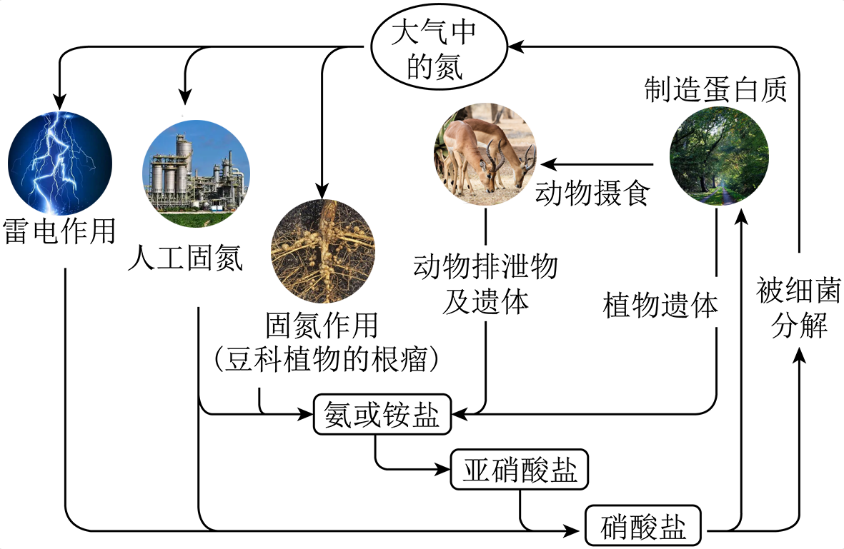〔图：自然界中的氮循环示意图（大气中的氮经雷电作用、人工固氮、豆科植物根瘤固氮转化为氨或铵盐，再经亚硝酸盐、硝酸盐，动植物摄食、排泄物及遗体被细菌分解回到大气）〕

> A．氮元素均被氧化
>
> B．工业合成氨属于人工固氮
>
> C．含氮无机物和含氮有机物可相互转化
>
> D．碳、氢、氧三种元素也参与了氮循环

【答案】A

【解析】A．硝酸盐中氮元素的化合价为+5价，被细菌分解变成大气中氮单质，氮元素由+5→0，属于被还原，故A错误；B．工业合成氨是将N₂与H₂在一定条件下反应生成NH₃，属于人工固氮，故B正确；C．氮循环中铵盐和蛋白质可相互转化，铵盐属于无机物，蛋白质属于有机物，含氮无机物和含氮有机物可相互转化，故C正确；D．碳、氢、氧三种元素也参加了氮循环，如蛋白质的制造需要碳元素，又如N₂在放电条件下与O₂直接化合生成无色且不溶于水的一氧化氮气体，N₂+O₂=(放电)=2NO，氧元素参与，二氧化氮易与水反应生成硝酸（HNO₃）和一氧化氮，3NO₂+H₂O=2HNO₃+NO，氢元素参加，故D正确；故选A。

2．（2025·江苏·高考真题）大气中的氮是取之不尽的天然资源。下列工业生产中以氮气作反应物的是

> A．工业合成氨 B．湿法炼铜 C．高炉炼铁 D．接触法制硫酸

【答案】A

【解析】A．工业合成氨的反应为N₂ 和H₂ 反应生成NH₃，氮气是直接反应物，A正确；B．湿法炼铜通过Fe置换CuSO₄中的Cu，反应不涉及氮气，B错误；C．高炉炼铁中氮气作为空气成分进入高炉，但未参与还原铁矿石的主要反应，C错误；D．接触法制硫酸涉及硫或硫化物的氧化，氮气未参与反应，D错误；故选A。

3．（2022·天津·高考真题）燃油汽车行驶中会产生CO、NO等多种污染物。下图为汽车发动机及催化转化器中发生的部分化学反应。以下判断错误的是

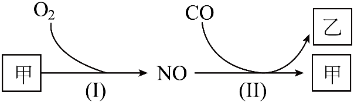〔图：物质转化关系图（甲经路线Ⅰ与O₂生成NO，NO经路线Ⅱ与CO生成乙和甲）〕

> A．甲是空气中体积分数最大的成分 B．乙是引起温室效应的气体之一
>
> C．反应(Ⅰ)在常温下容易发生 D．反应(Ⅱ)中NO是氧化剂

【答案】C

【解析】甲和氧气反应生成一氧化氮，一氧化氮和一氧化碳反应生成甲和二氧化碳，再根据元素守恒，则甲为氮气。A．甲是氮气，氮气空气中体积分数最大的成分，故A正确；B．乙是二氧化碳，则乙是引起温室效应的气体之一，故B正确；C．由于氮气含有氮氮三键，因此反应(Ⅰ)在常温下不容易发生，在高温或放电条件下发生，故C错误；D．一氧化碳和一氧化氮反应生成氮气和二氧化碳，一氧化氮中氮化合价降低，因此反应(Ⅱ)中NO是氧化剂，故D正确。综上所述，答案为C。

4．（2014·上海·高考真题）下图是用于干燥、收集并吸收多余气体的装置，下列方案正确的是

| 选项 | X | 收集气体 | Y | 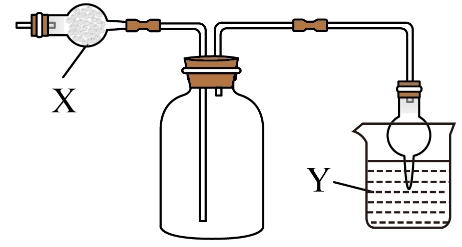〔图：实验装置图（X干燥管连接集气瓶，出气通入Y烧杯液面下）〕 |
|---|---|---|---|---|
| A | 碱石灰 | 氯化氢 | 水 |  |
| B | 碱石灰 | 氨气 | 水 |  |
| C | 氯化钙 | 二氧化硫 | 氢氧化钠 |  |
| D | 氯化钙 | 一氧化氮 | 氢氧化钠 |  |

【答案】C

【解析】A．氯化氢是酸性气体，不能用碱石灰干燥，A不正确；B．氨气密度小于空气，应该是短口进，长口出，B不正确；C．二氧化硫是酸性气体，能用氯化钙干燥，且二氧化硫的密度大于空气，用向上排空气法收集，C正确；D．一氧化氮极易被空气氧化生成二氧化氮，不能用排空气法收集，D不正确；答案选C。

5．（2009·广东·高考真题）下列各组气体在常温下能共存且能用向上排空气法收集的是

> A．NO和O₂ B．HCl和NH₃ C．H₂和CO D．SO₂和CO₂

【答案】D

【解析】A．NO与O₂不能共存，二者反应生成二氧化氮，错误；B．HCl和NH₃反应生成氯化铵，不能共存，错误；C．H₂和CO可以共存，但CO的密度与空气很接近，不能用排空气法收集，且氢气的密度比空气小，用向下排空气法收集，错误；D．SO₂和CO₂可以共存，且二者的密度都比空气大，所以可用向上排空气法收集，正确，答案选D。

6．（2016·浙江·高考真题）为落实“五水共治”，某工厂拟综合处理含NH₄⁺废水和工业废气（主要含N₂、CO₂、SO₂、NO、CO，不考虑其他成分），设计了如下流程：

下列说法不正确的是

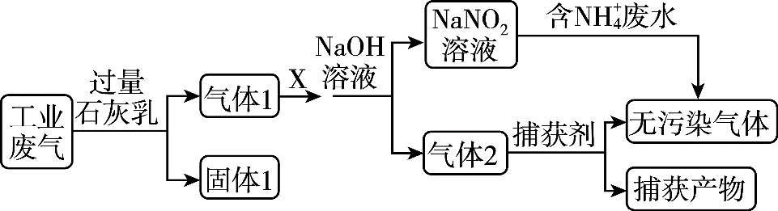〔图：工业废气处理流程图（工业废气加过量石灰乳得气体1和固体1，气体1与X、NaOH溶液生成NaNO₂溶液并处理含NH₄⁺废水，气体2经捕获剂得无污染气体和捕获产物）〕

> A．固体1中主要含有Ca(OH)₂、CaCO₃、CaSO₃
>
> B．X可以是空气，且需过量
>
> C．捕获剂所捕获的气体主要是CO
>
> D．处理含NH₄⁺废水时，发生反应的离子方程式为：NH₄⁺+NO₂⁻==N₂↑+2H₂O

【答案】B

【解析】工业废气中CO₂、SO₂可被石灰水吸收，生成固体1为CaCO₃、CaSO₃，气体1是不能被过量石灰水吸收的N₂、NO、CO，气体1通入气体X，用氢氧化钠溶液处理后到的NaNO₂，X可为空气，但不能过量，否则得到硝酸钠，NaNO₂与含有NH₄⁺的溶液反应生成无污染气体，应生成氮气，则气体2含有CO、N₂，捕获剂所捕获的气体主要是CO。A．工业废气中CO₂、SO₂可被石灰水吸收，生成CaCO₃、CaSO₃，因氢氧化钙过量，则固体1为主要含有Ca(OH)₂、CaCO₃、CaSO₃，故A正确；B．由分析可知，气体1是不能被过量石灰水吸收的N₂、NO、CO，气体1通入气体X，用氢氧化钠溶液处理后到的NaNO₂，X可为空气，但不能过量，否则得到硝酸钠，故B错误；C．气体2含有CO、N₂，经捕获剂得到氮气和CO，所捕获的气体主要是CO，防止污染空气，故C正确；D．NaNO₂与含有NH₄⁺的溶液反应生成无污染气体，应生成氮气，发生氧化还原反应，离子方程式为NH₄⁺+NO₂⁻=N₂↑+2H₂O，故D正确；故选B。

7．（2021·河北·高考真题）硫和氮及其化合物对人类生存和社会发展意义重大，但硫氧化物和氮氧化物造成的环境问题也日益受到关注，下列说法正确的是

> A．NO₂和SO₂均为红棕色且有刺激性气味的气体，是酸雨的主要成因
>
> B．汽车尾气中的主要大气污染物为NO、SO₂和PM2.5
>
> C．植物直接吸收利用空气中的NO和NO₂作为肥料，实现氮的固定
>
> D．工业废气中的SO₂可采用石灰法进行脱除

【答案】D

【解析】A．NO₂是红棕色且有刺激性气味的气体，而SO₂是无色有刺激性气味的气体，A错误；B．汽车尾气的主要大气污染物为C与N的氧化物，如NOₓ和CO等，B错误；C．氮的固定是指将游离态的氮元素转化为化合态，且植物可吸收土壤中的铵根离子或硝酸根离子作为肥料，不能直接吸收空气中的氮氧化物，C错误；D．工业废气中的SO₂可采用石灰法进行脱除，如加入石灰石或石灰乳均可进行脱硫处理，D正确；故选D。

8．（2019·江苏·高考真题）N₂O、NO和NO₂等氮氧化物是空气污染物，含有氮氧化物的尾气需处理后才能排放。

（1）N₂O的处理。N₂O是硝酸生产中氨催化氧化的副产物，用特种催化剂能使N₂O分解。NH₃与O₂在加热和催化剂作用下生成N₂O的化学方程式为        。

（2）NO和NO₂的处理。已除去N₂O的硝酸尾气可用NaOH溶液吸收，主要反应为

NO+NO₂+2OH⁻=2NO₂⁻+H₂O

2NO₂+2OH⁻=NO₂⁻+NO₃⁻+H₂O

> ①下列措施能提高尾气中NO和NO₂去除率的有        （填字母）。
>
> A．加快通入尾气的速率
>
> B．采用气、液逆流的方式吸收尾气
>
> C．吸收尾气过程中定期补加适量NaOH溶液
>
> ②吸收后的溶液经浓缩、结晶、过滤，得到NaNO₂晶体，该晶体中的主要杂质是        （填化学式）；吸收后排放的尾气中含量较高的氮氧化物是        （填化学式）。

（3）NO的氧化吸收。用NaClO溶液吸收硝酸尾气，可提高尾气中NO的去除率。其他条件相同，NO转化为NO₃⁻的转化率随NaClO溶液初始pH（用稀盐酸调节）的变化如图所示。

> ①在酸性NaClO溶液中，HClO氧化NO生成Cl⁻和NO₃⁻，其离子方程式为        。
>
> ②NaClO溶液的初始pH越小，NO转化率越高。其原因是        。

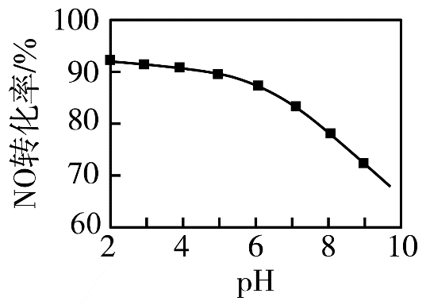〔图：NO转化率随pH变化的曲线图（pH 2~10，转化率约92%降至68%）〕

【答案】     2NH₃+2O₂=(Δ/催化剂)=N₂O+3H₂O     BC     NaNO₃     NO     3HClO+2NO+H₂O=3Cl⁻+2NO₃⁻+5H⁺     溶液pH越小，溶液中HClO的浓度越大，氧化NO的能力越强

【解析】（1）NH₃与O₂在加热和催化剂作用下发生氧化还原反应生成N₂O，根据得失电子守恒和原子守恒可知反应有水生成，配平化学方程式为：2NH₃+2O₂=(Δ/催化剂)=N₂O+3H₂O，

故答案为2NH₃+2O₂=(Δ/催化剂)=N₂O+3H₂O；

（2）①A．加快通入尾气的速率，不能提高尾气中NO和NO₂的去除率，不选A；

B．采用气、液逆流的方式吸收尾气，可使气液充分接触，能提高尾气中NO和NO₂的去除率，选B；

C．定期补充适量的NaOH溶液可增大反应物浓度，能提高尾气中NO和NO₂的去除率，选C。

故答案为BC；

②由吸收反应：NO+NO₂+2OH⁻=2NO₂⁻+H₂O，2NO₂+2OH⁻=NO₂⁻+ NO₃⁻+H₂O可知，反应后得到NaNO₂和NaNO₃混合溶液，经浓缩、结晶、过滤得到NaNO₂和NaNO₃晶体，因此得到的NaNO₂混有NaNO₃；由吸收反应可知，若NO和NO₂的物质的量之比大于1：1，NO不能被吸收，因此，吸收后排放的尾气中含量较高的氮氧化物是NO，

故答案为NaNO₃；NO；

（3）①在酸性的NaClO溶液中，次氯酸根离子和氢离子结合生成HClO，HClO和NO发生氧化还原反应生成NO₃⁻和Cl⁻，根据得失电子守恒及电荷守恒、原子守恒，配平离子方程式为2NO+3HClO+H₂O=2 NO₃⁻+3 Cl⁻+5H⁺，

故答案为2NO+3HClO+H₂O=2 NO₃⁻+3 Cl⁻+5H⁺；

②在相同条件下，氧化剂的浓度越大，氧化能力越强，由反应2NO+3HClO+H₂O=2NO₃⁻+3 Cl⁻+5H⁺可知，溶液pH越小，溶液中HClO浓度越大，氧化NO的能力越强，

故答案为溶液pH越小，溶液中HClO的浓度越大，氧化NO的能力越强。

9．（2018·天津·高考真题）烟道气中的NOₓ是主要的大气污染物之一，为了监测其含量，选用如下采样和检测方法。回答下列问题：

Ⅰ.采样

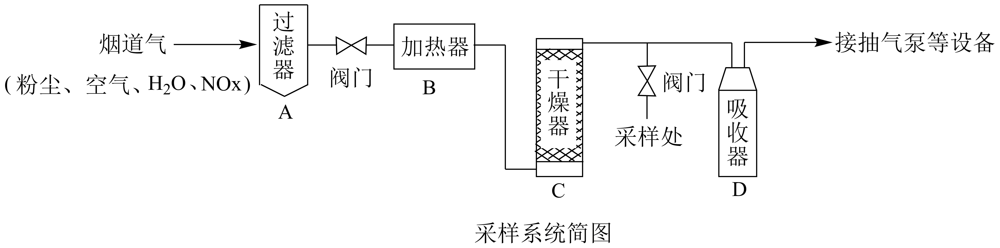〔图：烟道气采样系统简图（A过滤器、B加热器、C干燥器、D吸收器，接抽气泵等设备）〕

采样步骤：

> ①检验系统气密性；②加热器将烟道气加热至140℃；③打开抽气泵置换系统内空气；④采集无尘、干燥的气样；⑤关闭系统，停止采样。

（1）A中装有无碱玻璃棉，其作用是           。

（2）C中填充的干燥剂是（填序号）           。

> A．碱石灰 B．无水CuSO₄ C．P₂O₅

（3）用实验室常用仪器组装一套装置，其作用是与D（装有碱液）相同，在虚线框中画出该装置的示意图，标明气体的流向及试剂。

（4）采样步骤②加热烟道气的目的是           。

Ⅱ.NOₓ含量的测定

将v L气样通入适量酸化的H₂O₂溶液中，使NOₓ完全被氧化为NO₃⁻，加水稀释至100.00 mL。量取20.00 mL该溶液，加入v₁ mL c₁ mol·L⁻¹ FeSO₄标准溶液（过量），充分反应后，用c₂ mol·L⁻¹ K₂Cr₂O₇标准溶液滴定剩余的Fe²⁺，终点时消耗v₂ mL。

（5）NO被H₂O₂氧化为NO₃⁻的离子方程式是           。

（6）滴定操作使用的玻璃仪器主要有           。

（7）滴定过程中发生下列反应：

3Fe²⁺+NO₃⁻+4H⁺=NO↑+3Fe³⁺+2H₂O

Cr₂O₇²⁻ + 6Fe²⁺ +14H⁺ =2Cr³⁺ +6Fe³⁺+7H₂O

则气样中NOₓ折合成NO₂的含量为         mg·m⁻³。

（8）判断下列情况对NOₓ含量测定结果的影响（填“偏高” 、“偏低”或“无影响 ”）

若缺少采样步骤③，会使测试结果           。

若FeSO₄标准溶液部分变质，会使测定结果           。

【答案】     除尘     c     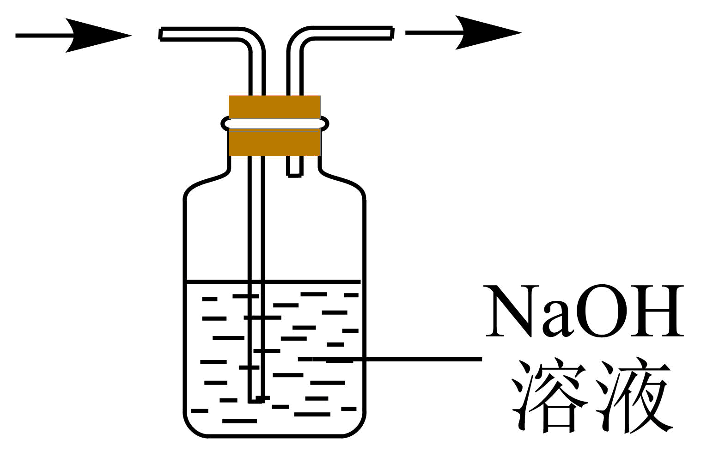〔图：盛NaOH溶液的洗气瓶装置图（双孔塞长短导管，气体长进短出）〕     防止NOₓ溶于冷凝水     2NO+3H₂O₂=2H⁺+2NO₃⁻+2H₂O     锥形瓶、酸式滴定管     (23(c₁V₁-6c₂V₂))/(3V)×10⁴     偏低     偏高

【解析】本题主要考查了定量实验的基本过程。首先要仔细分析题目的流程图，注意分析每一步的作用和原理，再结合题目中每个问题的提示进行解答。

（1）A的过程叫“过滤”，所以其中玻璃棉的作用一定是除去烟道气中的粉尘。

（2）碱石灰是碱性干燥剂可能与NOX反应，所以不能使用。硫酸铜的吸水能力太差，一般不用做干燥剂，所以不能使用。五氧化二磷是酸性干燥剂，与NOX不反应，所以选项c正确。

（3）实验室通常用洗气瓶来吸收气体，与D相同应该在洗气瓶中加入强碱（氢氧化钠）溶液，所以答案为：〔图：盛NaOH溶液的洗气瓶装置图（双孔塞长短导管，气体长进短出）〕。

（4）加热烟道气的目的是避免水蒸气冷凝后，NOX溶于水中。

（5）NO被H₂O₂氧化为硝酸，所以反应的离子方程式为：2NO+3H₂O₂=2H⁺+2NO₃⁻+2H₂O。

（6）滴定中使用酸式滴定管（本题中的试剂都只能使用酸式滴定管）和锥形瓶。

（7）用c₂ mol·L⁻¹ K₂Cr₂O₇标准溶液滴定剩余的Fe²⁺，终点时消耗V₂ mL，此时加入的Cr₂O₇²⁻为c₂V₂/1000 mol；所以过量的Fe²⁺为6c₂V₂/1000 mol；则与硝酸根离子反应的Fe²⁺为(c₁V₁/1000－6c₂V₂/1000) mol；所以硝酸根离子为(c₁V₁/1000－6c₂V₂/1000)/3 mol；根据氮元素守恒，硝酸根与NO₂的物质的量相等。考虑到配制100mL溶液取出来20mL进行实验，所以NO₂为5(c₁V₁/1000－6c₂V₂/1000)/3 mol，质量为46×5(c₁V₁/1000－6c₂V₂/1000)/3 g，即230(c₁V₁－6c₂V₂)/3 mg。这些NO₂是VL气体中含有的，所以含量为230(c₁V₁－6c₂V₂)/3V mg·L⁻¹，即为1000×230(c₁V₁－6c₂V₂)/3V mg·m⁻³，所以答案为：(23(c₁V₁-6c₂V₂))/(3V)×10⁴ mg·m⁻³。

（8）若缺少采样步骤③，装置中有空气，则实际测定的是烟道气和空气混合气体中NOX的含量，测定结果必然偏低。若FeSO₄标准溶液部分变质，一定是部分Fe²⁺被空气中的氧气氧化，计算时仍然认为这部分被氧化的Fe²⁺是被硝酸根离子氧化的，所以测定结果偏高。

10．（2017·北京·高考真题）SCR和NSR技术可有效降低柴油发动机在空气过量条件下的NOₓ排放。

（1）SCR(选择性催化还原)工作原理：

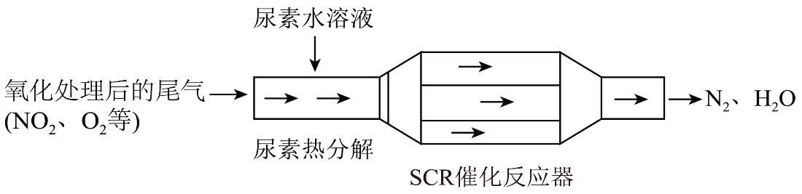〔图：SCR催化反应器处理尾气示意图（氧化处理后的尾气与尿素水溶液热分解后进入SCR催化反应器，生成N₂和H₂O）〕

> ① 尿素[CO(NH₂)₂]水溶液热分解为NH₃和CO₂，该反应的化学方程式：           。
>
> ② 反应器中NH₃还原NO₂的化学方程式：           。
>
> ③ 当燃油中含硫量较高时，尾气中SO₂在O₂作用下会形成(NH₄)₂SO₄，使催化剂中毒。用化学方程式表示(NH₄)₂SO₄的形成：           。
>
> ④ 尿素溶液浓度影响NO₂的转化，测定溶液中尿素(M=60 g·mol⁻¹)含量的方法如下：取a g尿素溶液，将所含氮完全转化为NH₃，所得NH₃用过量的v₁ mL c₁ mol·L⁻¹ H₂SO₄溶液吸收完全，剩余H₂SO₄用v₂ mL c₂ mol·L⁻¹ NaOH溶液恰好中和，则尿素溶液中溶质的质量分数是           。

（2）NSR(NOₓ储存还原)工作原理：NOₓ的储存和还原在不同时段交替进行，如图a所示。

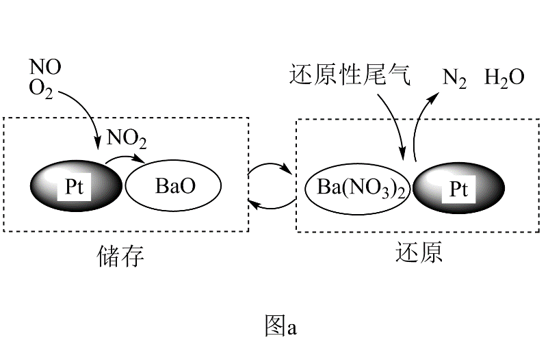〔图：图a NOx储存-还原原理图（储存：NO、O₂在Pt表面生成NO₂被BaO吸收；还原：Ba(NO₃)₂与还原性尾气在Pt上生成N₂、H₂O）〕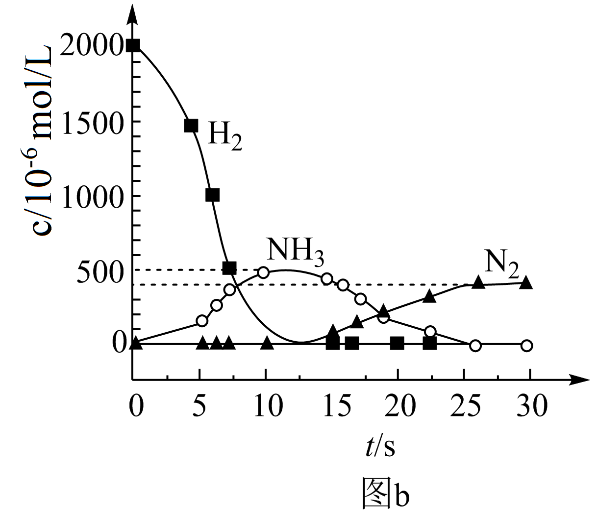〔图：图b H₂、NH₃、N₂浓度随时间变化曲线（c/10⁻⁶mol/L 对 t/s）〕

> ①通过BaO和Ba(NO₃)₂的相互转化实现NOₓ的储存和还原。储存NOₓ的物质是           。
>
> ② 用H₂模拟尾气中还原性气体研究了Ba(NO₃)₂的催化还原过程，该过程分两步进行，图b表示该过程相关物质浓度随时间的变化关系。第一步反应消耗的H₂与Ba(NO₃)₂的物质的量之比是           。
>
> ③ 还原过程中，有时会产生笑气(N₂O)。用同位素示踪法研究发现笑气的产生与NO有关。在有氧条件下¹⁵NO与NH₃以一定比例反应时，得到的笑气几乎都是¹⁵NNO。将该反应的化学方程式补充完整：           =(催化剂)=           ¹⁵NNO+           H₂O

【答案】     CO(NH₂)₂+H₂O=2NH₃↑+CO₂↑     8NH₃+6NO₂=(催化剂)=7N₂+12H₂O     2SO₂+O₂+4NH₃+2H₂O=2(NH₄)₂SO₄     (6c₁v₁−3c₂v₂)/(a)     BaO     8∶1     4¹⁵NO+4NH₃+3O₂     4     6

【解析】（1）①尿素[CO(NH₂)₂]水溶液热分解为NH₃和CO₂，结合原子守恒配平书写化学方程式；

②反应器中NH₃还原NO₂生成氮气和水，根据电子守恒和原子守恒可得此反应的化学方程式；③SO₂在O₂作用下与NH₃、H₂O反应形成(NH₄)₂SO₄，此反应中SO₂是还原剂，氧气是氧化剂，结合电子守恒和原子守恒可得此反应的化学方程式；④涉及反应为2NH₃+H₂SO₄=(NH₄)₂SO₄，2NaOH+H₂SO₄=Na₂SO₄+H₂O，由方程式可知n(NaOH)+n(NH₃)=2n(H₂SO₄)，以此计算；（2）①由图a可知储存NOₓ的物质是BaO；②第一步反应中H₂被氧化生成水，化合价由0价升高到+1价，Ba(NO₃)₂的N元素化合价由+5价降低到-3价，生成氨气，结合得失电子数目相等计算；③在有氧条件下¹⁵NO与NH₃以一定比例反应时，得到的笑气几乎都是¹⁵NNO，由N元素守恒可知¹⁵NO与NH₃应为1：1，结合电子得失相等配平。

（1）①尿素[CO(NH₂)₂]水溶液热分解为NH₃和CO₂，反应物为尿素和水，反应生成物为氨气和水，原子守恒书写化学方程式为：CO(NH₂)₂+H₂O=(Δ)= 2NH₃↑+CO₂↑；②NH₃在催化剂作用下还原NO₂生成氮气和水，反应的化学方程式为8NH₃+6NO₂=(催化剂)=7N₂+12H₂O；③SO₂在O₂作用下与NH₃、H₂O反应形成(NH₄)₂SO₄，此反应中SO₂是还原剂，氧气是氧化剂，反应的化学方程式为2SO₂+O₂+4NH₃+2H₂O═2(NH₄)₂SO₄；④涉及反应为2NH₃+H₂SO₄=(NH₄)₂SO₄，2NaOH+H₂SO₄=Na₂SO₄+H₂O，反应中n(H₂SO₄)=v₁×c₁×10⁻³mol，n(NaOH)=v₂×c₂×10⁻³mol，由方程式可知n(NaOH)+n(NH₃)=2n(H₂SO₄)，则n(NH₃)=(2v₁×c₁×10⁻³-v₂×c₂×10⁻³)mol，则m(CO(NH₂)₂)=(1)/(2)×(2v₁×c₁×10⁻³-v₂×c₂×10⁻³)mol×60g/mol=(0.06v₁c₁-0.03v₂c₂ )g，尿素溶液中溶质的质量分数是(0.06c₁V₁−0.03c₂V₂)/(a)×100=(6c₁V₁−3c₂V₂)/(a)；（2）①由图示可知BaO和NOₓ反应生成Ba(NO₃)₂，Ba(NO₃)₂再还原为N₂，则储存NOₓ的物质为BaO；②第一步反应中H₂被氧化生成水，化合价由0价升高到+1价，Ba(NO₃)₂的N元素化合价由+5价降低到-3价，生成氨气，则1molBa(NO₃)₂生成氨气转移16mol电子，参加反应的氢气的物质的量为(16)/(2)mol =8mol，则消耗的H₂与Ba(NO₃)₂的物质的量之比是8：1；③在有氧条件下¹⁵NO与NH₃以一定比例反应时，得到的笑气几乎都是¹⁵NNO，由N元素守恒可知¹⁵NO与NH₃应为1：1，可知反应的化学方程式为4¹⁵NO+4NH₃+3O₂=(催化剂)=4¹⁵NNO+6H₂O。

11．（2016·全国I卷·高考真题）氮的氧化物(NOₓ)是大气污染物之一，工业上在一定温度和催化剂条件下用NH₃将NOₓ还原生成N₂。某同学在实验室中对NH₃与NOₓ反应进行了探究。回答下列问题：

（1）氨气的制备

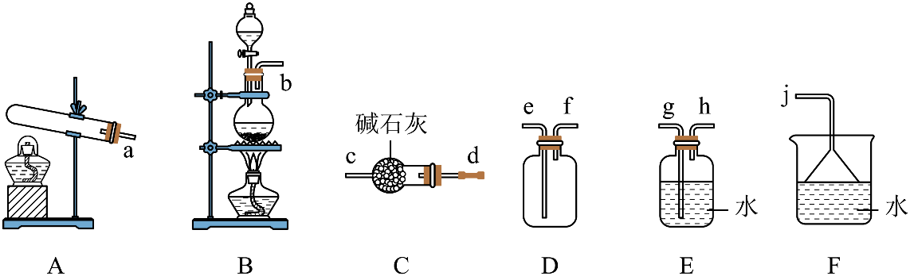〔图：气体制取与收集装置图A~F（A固体加热、B固液加热、C碱石灰干燥管、D集气瓶、E水洗气瓶、F倒置漏斗吸收）〕

> ①氨气的发生装置可以选择上图中的         ，反应的化学方程式为               。
>
> ②欲收集一瓶干燥的氨气，选择上图中的装置，其连接顺序为：发生装置→      (按气流方向，用小写字母表示)。

（2）氨气与二氧化氮的反应

将上述收集到的NH₃充入注射器X中，硬质玻璃管Y中加入少量催化剂，充入NO₂(两端用夹子K₁、K₂夹好)。在一定温度下按图示装置进行实验。

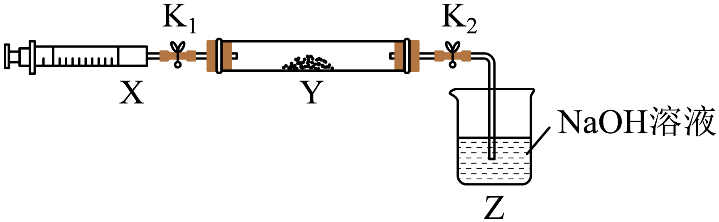〔图：实验装置图（注射器X经旋塞K₁连接Y玻璃管，再经K₂通入Z烧杯NaOH溶液）〕

| 操作步骤 | 实验现象 | 解释原因 |
|---|---|---|
| 打开K₁，推动注射器活塞，使X中的气体缓慢通入Y管中 | ①Y管中 | ②反应的化学方程式 |
| 将注射器活塞退回原处并固定，待装置恢复到室温 | Y管中有少量水珠 | 生成的气态水凝集 |
| 打开K₂ | ③ | ④ |

【答案】     A(或B)     2NH₄Cl+Ca(OH)₂=(Δ)=2NH₃↑+ CaCl₂+2H₂O(或B NH₃·H₂O=(Δ)=NH₃↑+H₂O)     d→c→f→e→i     红棕色气体慢慢变浅     8NH₃+6NO₂=(催化剂)=7N₂ +12H₂O     Z中NaOH溶液产生倒吸现象     反应后气体分子数减少，Y管中压强小于外压

【解析】（1）①实验室可以用加热固体氯化铵和氢氧化钙的方法制备氨气，反应物状态为固体，反应条件为加热，所以选择A为发生装置，反应方程式为Ca(OH)₂+2NH₄Cl=(Δ)=CaCl₂+2NH₃↑+2H₂O，也可以选择装置B用加热浓氨水的方法制备氨气，反应方程式为NH₃·H₂O=(Δ)=NH₃↑+H₂O，故答案为A (或B)；Ca(OH)₂+2NH₄Cl=(Δ)=CaCl₂+2NH₃↑+2H₂O(或B NH₃·H₂O=(Δ)=NH₃↑+H₂O)；

②实验室制备的氨气中含有水蒸气，氨气为碱性气体，应选择盛有碱石灰的干燥管干燥气体，氨气极易溶于水，密度小于空气密度，所以应选择向下排空气法收集气体，氨气极易溶于水，尾气可以用水吸收，注意防止倒吸的发生，所以正确的连接顺序为：发生装置→d→c→f→e→i；故答案为d→c→f→e→i；

（2）打开K₁，推动注射器活塞，使X中的气体缓慢充入Y管中，则氨气与二氧化氮发生归中反应生成无色氮气，所以看到现象为：红棕色气体慢慢变浅；根据反应8NH₃+6NO₂=(催化剂)=7N₂+12H₂O以及装置恢复至室温后气态水凝聚可判断反应后气体分子数减少，Y装置内压强降低，所以打开K₂在大气压的作用下Z中NaOH溶液发生倒吸，故答案为红棕色气体慢慢变浅；8NH₃+6NO₂=(催化剂)=7N₂ +12H₂O；Z中NaOH溶液产生倒吸现象；反应后气体分子数减少，Y管中压强小于外压。

12．（2015·山东·高考真题）工业上利用氨氧化获得的高浓度NOₓ气体(含NO、NO₂)制备NaNO₂、NaNO₃，工艺流程如下：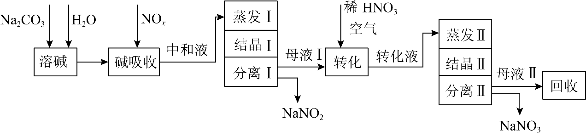〔图：纯碱吸收NOx制NaNO₂和NaNO₃流程图（溶碱、碱吸收、蒸发结晶分离Ⅰ得NaNO₂，母液转化、蒸发结晶分离Ⅱ得NaNO₃，母液Ⅱ回收）〕

已知：Na₂CO₃＋NO＋NO₂=2NaNO₂＋CO₂

（1）中和液所含溶质除NaNO₂及少量Na₂CO₃外，还有          (填化学式)。

（2）中和液进行蒸发Ⅰ操作时，应控制水的蒸发量，避免浓度过大，目的是       。蒸发Ⅰ产生的蒸气中含有少量的NaNO₂等有毒物质，不能直接排放，将其冷凝后用于流程中的       (填操作名称)最合理。

（3）母液Ⅰ进行转化时加入稀HNO₃的目的是       。母液Ⅱ需回收利用，下列处理方法合理的是        。

> a．转入中和液 b．转入结晶Ⅰ操作
>
> c．转入转化液 d．转入结晶Ⅱ操作

（4）若将NaNO₂、NaNO₃两种产品的物质的量之比设为2：1，则生产1.38吨NaNO₂时，Na₂CO₃的理论用量为      吨(假定Na₂CO₃恰好完全反应)。

【答案】     NaNO₃     防止NaNO₃的析出     溶碱     将NaNO₂氧化为NaNO₃     C．d     1.59

【解析】（1）NO₂与碱液反应可生成NaNO₃；

（2）浓度过大时，NaNO₃可能会析出；NaNO₂有毒，不能直接排放，回收后可用于流程中的溶碱；

（3）NaNO₂在酸性条件下易被氧化，加入稀硝酸可提供酸性环境；母液Ⅱ的溶质主要是NaNO₃，所以回收利用时应转入转化液，或转入结晶Ⅱ操作，故C．d正确；

（4）1.38吨NaNO₂的物质的量为：1.38×10⁶÷69g/mol=2×10⁴mol，则生成的NaNO₃物质的量为：1×10⁴mol，故Na₂CO₃的理论用量=(1)/(2)×（2×10⁴+1×10⁴）mol×106g/mol=1.59×10⁶g=1.59吨。

考点02 氨及铵盐

1．（2024·广东·高考真题）按下图装置进行实验。搅拌一段时间后，滴加浓盐酸。不同反应阶段的预期现象及其相应推理均合理的是

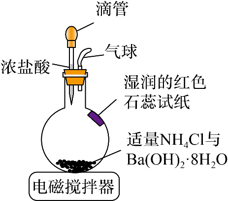〔图：NH₄Cl与Ba(OH)₂·8H₂O反应吸热实验装置图（烧瓶内有滴管、气球、湿润的红色石蕊试纸，置于电磁搅拌器上）〕

> A．烧瓶壁会变冷，说明存在ΔH<0的反应
>
> B．试纸会变蓝，说明有NH₃生成，产氨过程熵增
>
> C．滴加浓盐酸后，有白烟产生，说明有NH₄Cl升华
>
> D．实验过程中，气球会一直变大，说明体系压强增大

【答案】B

【解析】A．烧瓶壁变冷说明八水氢氧化钡与氯化铵的反应是焓变大于0的吸热反应，故A错误；B．试纸会变蓝，说明八水氢氧化钡与氯化铵反应时有氨气生成，该反应是熵增的反应，故B正确；C．滴加浓盐酸后，有白烟产生是因为浓盐酸挥发出的氯化氢气体与反应生成的氨气生成了氯化铵，与氯化铵的升华无关，故C错误；D．八水氢氧化钡与氯化铵生成氯化钡和一水合氨的反应是焓变大于0的吸热反应，烧瓶中温度降低、气体压强会减小会导致气球变小，后因为一水合氨分解生成氨气导致气体压强增大，气球会变大，滴入盐酸后，浓盐酸挥发出的氯化氢气体与反应生成的氨气生成了氯化铵，导致气体压强变小，则实验过程中，气球先变小、后增大，加入盐酸后又变小，故D错误；故选B。

2．（2024·湖北·高考真题）碱金属的液氨溶液含有的蓝色溶剂化电子[e(NH₃)ₙ]⁻是强还原剂。锂与液氨反应的装置如图(夹持装置略)。下列说法错误的是

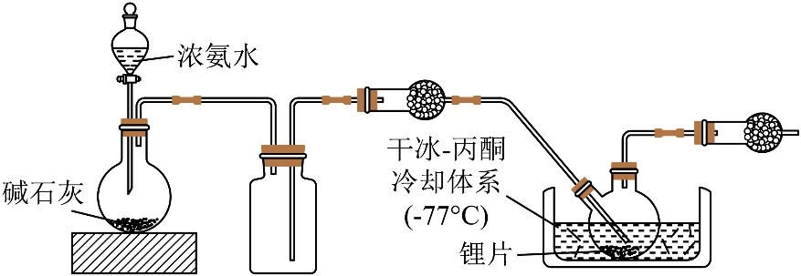〔图：浓氨水与碱石灰制NH₃经干燥后与锂片在干冰-丙酮冷却体系(-77°C)中反应的装置图〕

> A．碱石灰有利于NH₃逸出
>
> B．锂片必须打磨出新鲜表面
>
> C．干燥管中均可选用P₂O₅
>
> D．双口烧瓶中发生的变化是Li+nNH₃=Li⁺+[e(NH₃)ₙ]⁻

【答案】C

【解析】本题利用Li和液氨反应Li+nNH₃=Li⁺+[e(NH₃)ₙ]⁻制备[e(NH₃)ₙ]⁻；碱石灰可以吸收浓氨水中的水分，同时吸水过程大量放热，使浓氨水受热分解产生氨气；利用集气瓶收集氨气；过量的氨气进入双口烧瓶中在冷却体系中发生反应生成[e(NH₃)ₙ]⁻；最后的球形干燥管中可装P₂O₅，除掉过量的氨气，同时防止空气的水进入引起副反应。A．碱石灰为生石灰和氢氧化钠的混合物，可以吸收浓氨水中的水分，同时吸水过程大量放热，有利于NH₃逸出，A正确；B．锂片表面有Li₂O，Li₂O会阻碍Li和液氨的接触，所以必须打磨出新鲜表面，B正确；C．第一个干燥管目的是干燥氨气，P₂O₅为酸性干燥剂能与氨气反应，所以不能用P₂O₅，而装置末端的干燥管作用为吸收过量的氨气，可用P₂O₅，C错误；D．双口烧瓶中发生的变化是Li+nNH₃=Li⁺+[e(NH₃)ₙ]⁻，D正确；故选C。

3．（2023·广东·高考真题）1827年，英国科学家法拉第进行了NH₃喷泉实验。在此启发下，兴趣小组利用以下装置，进行如下实验。其中，难以达到预期目的的是

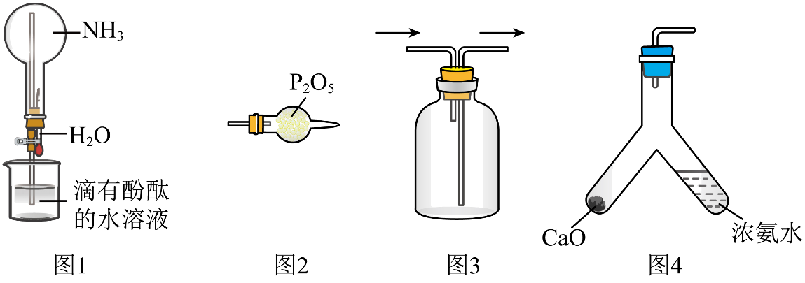〔图：图1 NH₃喷泉实验（滴有酚酞的水溶液）；图2 P₂O₅干燥管；图3 集气瓶；图4 CaO与浓氨水制氨装置〕

> A．图1：喷泉实验  B．图2：干燥NH₃  C．图3：收集NH₃ D．图4：制备NH₃

【答案】B

【解析】A．NH₃极易溶于水，溶于水后圆底烧瓶内压强减小，从而产生喷泉，故A可以达到预期；B．P₂O₅为酸性氧化物，NH₃具有碱性，两者可以发生反应，故不可以用P₂O₅干燥NH₃，故B不可以达到预期；C．NH₃的密度比空气小，可采用向下排空气法收集，故C可以达到预期；D．CaO与浓氨水混合后与水反应并放出大量的热，促使NH₃挥发，可用此装置制备NH₃，故D可以达到预期；故选B。

4．（2022·重庆·高考真题）工业上用N₂和H₂合成NH₃，NA代表阿伏加德罗常数的值，下列说法正确的是

> A．消耗14gN₂生成NH₃分子数为2 NA
>
> B．消耗1molH₂，生成N－H键数为2 NA
>
> C．生成标准状况下22.4LNH₃，电子转移数为2 NA
>
> D．氧化1molNH₃生成NO，需O₂分子数为2 NA

【答案】B

【解析】A．由方程式可知，消耗14g氮气生成氨气的分子数为(14g)/(28g/mol) ×2×NAmol⁻¹=NA，故A错误；B．由方程式可知，消耗1mol氢气生成N－H键数为1mol×(2)/(3) ×3×NAmol⁻¹=2NA，故B正确；C．由方程式可知，生成标准状况下22.4L氨气，反应电子转移数为(22.4L)/(22.4L/mol) ×3×NAmol⁻¹=3NA，故C错误；D．由得失电子数目守恒可知，1mol氨气与氧气反应生成一氧化氮，需氧气分子数为1mol×(5)/(4) ×NAmol⁻¹=1.25NA，故D错误；故选B。

5．（2020·北京·高考真题）某同学进行如下实验：

|  | 实验步骤 | 实验现象 |
|---|---|---|
| I | 将NH₄Cl固体加入试管中，并将湿润的pH试纸置于试管口，试管口略向下倾斜，对试管底部进行加热 | 试纸颜色变化：黄色→蓝色(pH≈10)→黄色→红色(pH≈2)；试管中部有白色固体附着 |
| II | 将饱和NH₄Cl溶液滴在pH试纸上 | 试纸颜色变化：黄色→橙黄色(pH≈5) |

下列说法不正确的是

> A．根据I中试纸变蓝，说明NH₄Cl发生了分解反应
>
> B．根据I中试纸颜色变化，说明氨气比氯化氢气体扩散速率快
>
> C．I中试纸变成红色，是由于NH₄Cl水解造成的
>
> D．根据试管中部有白色固体附着，说明不宜用加热NH₄Cl的方法制备NH₃

【答案】C

【解析】实验I中对NH₄Cl固体试管加热，湿润的pH试纸黄色→蓝色(pH≈10)→黄色→红色(pH≈2)，说明加热过程中生成了氨气，氨气遇水形成一水合氨，一水合氨为弱碱，使试纸变蓝，同时产生了氯化氢气体，氯化氢极易溶于水形成盐酸，中和了一水合氨恢复到黄色，最后变为红色，该过程可证明氯化铵受热发生分解生成氨气和氯化氢气体，试纸先变蓝后变红，说明氨气扩散的速度比氯化氢快；试管中部有白色固体附着，说明氯化铵分解产生的氨气和氯化氢在扩散过程中由化合生成氯化铵；

实验II中将氯化铵溶液滴在pH试纸上，试纸颜色变化：黄色→橙黄色(pH≈5)，说明氯化铵溶液中铵根离子水解使溶液显酸性，据此分析解答。A．氯化铵是强酸弱碱盐，其水溶液显酸性，会使湿润的pH试纸变红，根据I中试纸变蓝，说明NH₄Cl发生了分解反应，故A正确；B．根据分析，根据I中试纸颜色变化，说明氨气比氯化氢气体扩散速率快，故B正确；C．根据分析，I中试纸变成红色，是由于NH₄Cl分解产生的氯化氢造成的，故C错误；D．根据分析，根据试管中部有白色固体附着，说明氯化铵分解产生的氨气和氯化氢在扩散过程中由化合生成氯化铵，则不宜用加热NH₄Cl的方法制备NH₃，故D正确；答案选C。

6．（2012·上海·高考真题）实验室制取少量干燥的氨气涉及下列装置，其中正确的是

| 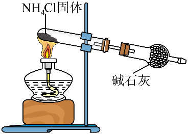〔图：加热NH₄Cl固体制取气体并用碱石灰干燥的装置图〕 | 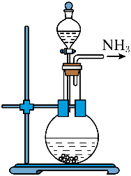〔图：分液漏斗向圆底烧瓶滴加液体制取NH₃的装置图〕 | 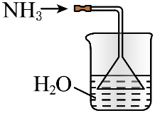〔图：NH₃通入水中用倒置漏斗防倒吸的吸收装置图〕 | 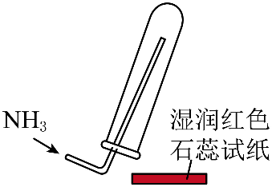〔图：向下倾斜试管收集NH₃并用湿润红色石蕊试纸检验的装置图〕 |
|---|---|---|---|
| A．是氨气发生装置 | B．是氨气发生装置 | C．是氨气吸收装置 | D．是氨气收集、检验装置 |

【答案】B

【解析】A．NH₄Cl固体受热分解生成的NH₃和HCl在试管口遇冷会重新化合生成NH₄Cl，故A错误；B．将浓氨水滴到生石灰固体上时，生石灰与水反应放热会导致NH₃逸出，此为氨气的发生装置，故B正确；C．NH₃极易溶于水，为防止倒吸，倒置的漏斗口刚接触水面即可，不能浸于水中，故C错误；D．收集NH₃时，为防止NH₃与空气形成对流使收集的NH₃不纯，通常在导管口放置棉花团，故D错误；答案选B。

7．（2008·上海·高考真题）已知气体的摩尔质量越小，扩散速度越快。右图所示为气体扩散速度的实验，两种气体扩散相遇时形成白色烟环。下列关于甲、乙的判断正确的是

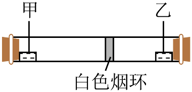〔图：水平玻璃管两端甲、乙棉团扩散相遇形成白色烟环的实验装置图〕

> A．甲是浓氨水，乙是浓硫酸 B．甲是浓盐酸，乙是浓氨水
>
> C．甲是浓氨水，乙是浓盐酸 D．甲是浓硝酸，乙是浓氨水

【答案】C

【解析】题中已经告知气体的摩尔质量越小，扩散速度越快。则白色烟环靠近摩尔质量大的气体的那一侧。A． 浓硫酸不具有挥发性，该组实验无法看到白色烟环，A错误；B． HCl的摩尔质量比NH₃大，所以烟环靠捡浓盐酸（甲）一侧，B错误；C． HCl的摩尔质量比NH₃大，所以烟环靠捡浓盐酸（乙）一侧，C正确；D． HNO₃的摩尔质量比NH₃大，所以烟环靠捡浓硝酸（甲）一侧，D错误；故合理选项为C。

8．（2008·上海·高考真题）右图的装置中，干燥烧瓶内盛有某种气体，烧杯和滴定管内盛放某种液体。挤压滴管的胶头，下列与实验事实不相符的是

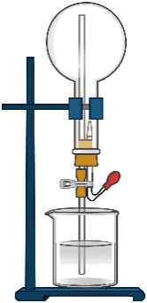〔图：喷泉实验装置图（圆底烧瓶倒置，胶头滴管，下接烧杯）〕

> A．CO₂(NaHCO₃溶液)/无色喷泉 B．NH₃(H₂O含酚酞)/红色喷泉
>
> C．H₂S(CuSO₄溶液)/黑色喷泉 D．HCl(AgNO₃溶液)/白色喷泉

【答案】A

【解析】A．NaHCO₃与CO₂不反应，烧瓶内的压强不变，不能形成喷泉，故选A；B．NH₃易溶于水，形成NH₃·H₂O，NH₃·H₂O=NH₄＋OH⁻，溶液呈碱性，能形成红色喷泉，故不选B；C．H₂S＋CuSO₄=H₂SO₄＋CuS↓，CuS为黑色沉淀，能形成黑色喷泉，故不选C；D．HCl＋AgNO₃=HNO₃＋AgCl↓，AgCl为白色沉淀，能形成白色喷泉，故不选D。答案选A。

9．（2017·上海·高考真题）将NH₃ 通过灼热的CuO，发现生成一种红色的单质和一种气体单质，这种气体单质是

> A．O₂ B．H₂ C．N₂ D．NO

【答案】C

【解析】将NH₃ 通过灼热的CuO，发现生成一种红色的单质和一种气体单质，红色的单质为铜，铜元素的化合价降低，根据氧化还原反应的规律和质量守恒，N元素的化合价升高，气体单质只能为氮气，故选C。

10．（2017·浙江·高考真题）下列能使湿润的红色石蕊试剂变蓝的气体是

> A．NH₃ B．SO₃ C．HCl D．CO₂

【答案】A

【解析】A．NH₃是碱性气体，能使湿润的红色石蕊试剂变蓝，A正确；B．SO₃溶于水生成强酸硫酸，不能使湿润的红色石蕊试剂变蓝，B错误；C．HCl溶于水得到强酸盐酸，不能使湿润的红色石蕊试剂变蓝，C错误；D．CO₂是酸性氧化物，不能使湿润的红色石蕊试剂变蓝，D错误。答案选A。

11．（2012·福建·高考真题）下列物质与水作用形成的溶液能与NH₄Cl反应生成NH₃的是

> A．二氧化氮 B．钠 C．硫酸镁 D．二氧化硅

【答案】B

【解析】A．二氧化氮溶于水生成硝酸和NO，硝酸与氯化铵不反应，A错误；B．钠溶于水生成氢氧化钠和氢气，氢氧化钠是强碱，与氯化铵反应生成氨气，B正确；C．硫酸镁溶液与氯化铵不反应，C错误；D．二氧化硅不溶于水，与氯化铵不反应，D错误；答案选B。

12．（2011·江苏·高考真题）下列有关实验原理或实验操作正确的是

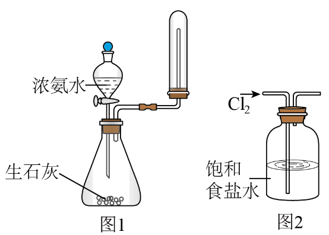〔图：图1 浓氨水与生石灰制取并收集NH₃装置；图2 Cl₂通入饱和食盐水洗气装置〕

> A．用水湿润的pH试纸测量某溶液的pH
>
> B．用量筒量取20 mL0.5000 mol·L⁻¹ H₂SO₄溶液于烧杯中，加水80mL，配制成0.1000 mol· L⁻¹H₂SO₄溶液
>
> C．实验室用图1所示装置制取少量氨气
>
> D．实验室用图2所示装置除去Cl₂中的少量HCl

【答案】D

【解析】A．用水润湿的pH试纸，溶液稀释，则测定pH时试纸不能润湿，故A错误；B．配制80mL0.1000 mol•L⁻¹H₂SO₄溶液需要100mL容量瓶，应在烧杯中稀释、冷却后转移到容量瓶中定容，故B错误；C．收集氨气的试管口不能密封，可塞一团棉花，故C错误；D．HCl极易溶于水，食盐水抑制氯气的溶解，则用图2所示装置除去Cl₂中的少量HCl，故D正确；故选D。

13．（2009·上海·高考真题）用浓氯化铵溶液处理过的舞台幕布不易着火。其原因是 ( 　　 )

> ①幕布的着火点升高 ②幕布的质量增加
>
> ③氯化铵分解吸收热量，降低了温度 ④氯化铵分解产生的气体隔绝了空气
>
> A．①② B．③④ C．①③ D．②④

【答案】B

【解析】氯化铵分解吸收热量，能降低火焰温度，达不到幕布的着火点；并且分解产物氯化氢和氨气能隔绝空气，均破坏了可燃物的燃烧条件，故能使幕布不易着火，答案选B。

14．（2016·上海·高考真题）称取(NH₄)₂SO₄和NH₄HSO₄混合物样品7.24 g，加入含0.1 mol NaOH的溶液，完全反应，生成NH₃1792 mL（标准状况），则(NH₄)₂SO₄和NH₄HSO₄的物质的量比为

> A．1:1 B．1:2 C．1.87:1 D．3.65:1

【答案】C

【解析】利用极值法分析，可知0.1mol氢氧化钠不足，故先将NH₄HSO₄反应完，再反应(NH₄)₂SO₄，因共生成NH₃0.08mol，故与H⁺反应的氢氧化钠为0.02mol，则NH₄HSO₄为0.02mol，所以(NH₄)₂SO₄质量为7.24g-115g/mol×0.02mol=4.94g，(NH₄)₂SO₄的物质的量为4.94g ÷132g/mol=0.0374mol。因此(NH₄)₂SO₄与NH₄HSO₄物质的量之比为：1.87：1，故选C。

15．（2012·海南·高考真题）氮元素的氢化物和氧化物在工业生产和国防建设中都有广泛应用，回答下列问题：

（1）氮元素原子的L层电子数为       ；

（2）NH₃与NaClO反应可得到肼(N₂H₄)，该反应的化学方程式为       ；

（3）肼可作为火箭发动机的燃料，与氧化剂N₂O₄反应生成N₂和水蒸气。

已知：①N₂(g)+2O₂(g)= N₂O₄ （1） △H₁= -19.5kJ·mol⁻¹

> ②N₂H₄ （1） + O₂(g)= N₂(g) + 2 H₂O(g) △H₂= -534.2kJ·mol⁻¹

写出肼和N₂O₄反应的热化学方程式       ；

（4）肼一空气燃料电池是一种碱性电池，该电池放电时，负极的反应式为       。

【答案】     5     2NH₃+NaClO=N₂H₄+NaCl+H₂O     2N₂H₄(l)+ N₂O₄(l)=3 N₂(g)+ 4H₂O(g) △H=-1048.9kJ/mol     N₂H₄+ 4OH⁻-4e⁻ =4H₂O +N₂↑

【解析】（1）N原子的核外电子排布式为1s²2s²2p³，所以氮元素原子的L层电子数为5，故答案为5；

（2）NH₃与NaClO发生氧化还原反应可得到肼(N₂H₄)、氯化钠和水，所以该反应的化学方程式为：2NH₃+NaClO=N₂H₄+NaCl+H₂O，故答案为2NH₃+NaClO=N₂H₄+NaCl+H₂O；

（3）肼可作为火箭发动机的燃料，与氧化剂N₂H₄反应生成N₂和水蒸气，将方程式②×2-①得肼和N₂H₄反应的热化学方程式2N₂H₄(l)+N₂O₄(l)=3N₂(g)+4H₂O(g)△H=-1048.9kJ/mol，故答案为2N₂H₄(l)+N₂O₄(l)=3N₂(g)+4H₂O(g)△H=-1048.9kJ/mol；

（4）肼一空气燃料碱性电池中，负极上肼失电子和氢氧根离子反应生成水和氮气，电极反应式为：N₂H₄+4OH⁻-4e⁻=4H₂O+N₂，故答案为N₂H₄+4OH⁻-4e⁻=N₂+4H₂O。

16．（2009·海南·高考真题）工业上常用氨氧化法生产硝酸，其过程包括氨的催化氧化(催化剂为铂铑合金丝网)、一氧化氮的氧化和水吸收二氧化氮生成硝酸。请回答下列问题：

（1）氨催化氧化的化学方程式为       ：

（2）原料气中空气必须过量，其主要原因是       ；

（3）将铂铑合金做成薄丝网的主要原因是       ；

（4）水吸收二氧化氮生成硝酸为放热反应，其化学方程式为       ，为了提高水对二氧化氮的吸收率，可采取的措施为       (答2项)

【答案】     4NH₃+5O₂⇌(Pt-Rh/高温)4NO+H₂O     提高氨的转化率和一氧化氮的转化率     增大单位质量的催化剂与反应物的接触面积     3NO₂ + H₂O = 2HNO₃ + NO     加压 降温

【解析】（1）氨催化氧化的产物是一氧化氮和水，是工业生产硝酸获得一氧化氮的一步反应，化学方程式为4NH₃+5O₂=(Pt-Rh/高温)=4NO+6H₂O，

因此，本题正确答案是：4NH₃+5O₂=(Pt-Rh/高温)=4NO+6H₂O，；

（2）根据化学平衡移动原理：增加原料气中空气的量，即加大了氧气的量可以使平衡向右移动，提高氨的转化率和一氧化氮的生成率，

因此，本题正确答案是：提高氨的转化率和一氧化氮的生成率；

（3）在氨催化氧化时，将铂铑合金做成薄丝网，可以增大单位质量的催化剂与反应物的接触面积，让反应更充分，

因此，本题正确答案是：增大单位质量的催化剂与反应物的接触面积；

（4）水吸收二氧化氮生成硝酸的反应为3NO₂+H₂O=2HNO₃+NO，该反应放热，可以使平衡向右移动的方法是：加压、降温或及时把生成的硝酸移走，

因此，本题正确答案是：3NO₂+H₂O=2HNO₃+NO；加压、降温 (及时移走生成的硝酸)。

17．（2022·浙江·高考真题）氨基钠(NaNH₂)是重要的化学试剂，实验室可用下图装置(夹持、搅拌、尾气处理装置已省略)制备。

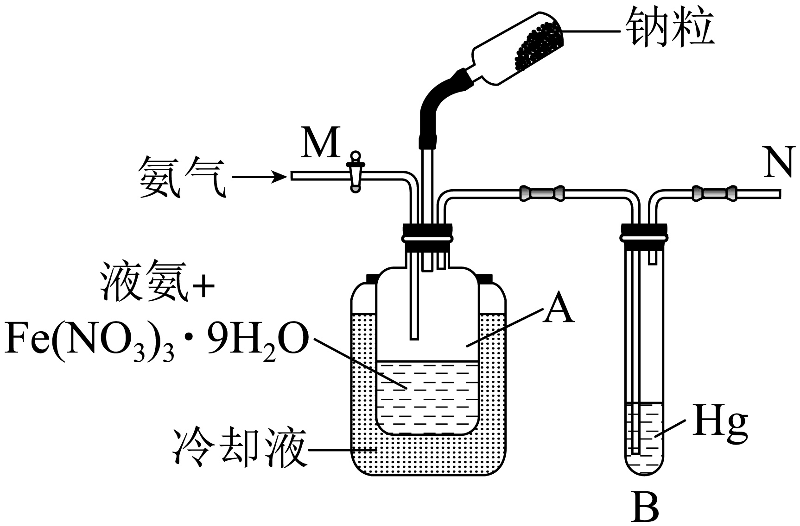〔图：钠粒与液氨反应装置图（A为液氨+Fe(NO₃)₃·9H₂O反应瓶置于冷却液中，M、N为旋塞，B为Hg液封试管）〕

简要步骤如下：

Ⅰ.在瓶A中加入100mL液氨和0.05g Fe(NO₃)₃⋅9H₂O，通入氨气排尽密闭体系中空气，搅拌。

Ⅱ.加入5g钠粒，反应，得NaNH₂粒状沉积物。

Ⅲ.除去液氨，得产品NaNH₂。

已知：NaNH₂几乎不溶于液氨，易与水、氧气等反应。

2Na+2NH₃=2NaNH₂+H₂↑

NaNH₂+H₂O=NaOH+NH₃↑

4NaNH₂+3O₂=2NaOH+2NaNO₂+2NH₃

请回答：

（1）Fe(NO₃)₃⋅9H₂O的作用是       ；装置B的作用是       。

（2）步骤Ⅰ，为判断密闭体系中空气是否排尽，请设计方案       。

（3）步骤Ⅱ，反应速率应保持在液氨微沸为宜。为防止速率偏大，可采取的措施有       。

（4）下列说法不正确的是_______。

> A．步骤Ⅰ中，搅拌的目的是使Fe(NO₃)₃⋅9H₂O均匀地分散在液氨中
>
> B．步骤Ⅱ中，为判断反应是否已完成，可在N处点火，如无火焰，则反应已完成
>
> C．步骤Ⅲ中，为避免污染，应在通风橱内抽滤除去液氨，得到产品NaNH₂
>
> D．产品NaNH₂应密封保存于充满干燥氮气的瓶中

（5）产品分析：假设NaOH是产品NaNH₂的唯一杂质，可采用如下方法测定产品NaNH₂纯度。从下列选项中选择最佳操作并排序       。

准确称取产品NaNH₂xg→()→()→()→计算

> a．准确加入过量的水
>
> b．准确加入过量的HCl标准溶液
>
> b．准确加入过量的NH₄Cl标准溶液
>
> d．滴加甲基红指示剂(变色的pH范围4.4～6.2)

e.滴加石蕊指示剂(变色的pH范围4.5～8.3)

f.滴加酚酞指示剂(变色的pH范围8.2～10.0)

g.用NaOH标准溶液滴定

h.用NH₄Cl标准溶液滴定

i.用HCl标准溶液滴定

【答案】（1）     催化     防止氧气、水进入密闭体系

（2）试管中加满水倒扣于水槽中，M处通入氨气，将N处排出的气体导入试管内。如试管底部出现气泡，则空气尚未排尽，如未出现气泡，则说明空气已排尽

（3）分批少量加入钠粒；降低冷却液温度；适当增加液氨量（任写一种即可）

（4）BC

（5）bdg

【解析】在硝酸铁催化下钠与液氨的反应来生成NaNH₂和氢气，该反应是放热反应，为保证液氨处于微沸状态，需要用冷却液控制一定的温度。NaNH₂易与水和氧气发生反应，所以装置B中Hg可防止氧气、水进入密闭体系，导气口N与尾气处理连接装置再处理氨气等，据此结合实验原理分析解答。

（1）结合实验原理，根据实验操作中加入Fe(NO₃)₃⋅9H₂O的用料很少，可推知，Fe(NO₃)₃⋅9H₂O在反应中作催化剂，加快反应速率；结合已知信息可知，制备得到的NaNH₂易与水和氧气发生反应，所以装置B中Hg可防止氧气、水进入密闭体系，干扰NaNH₂的制备，

故答案为：催化；防止氧气、水进入密闭体系；

（2）结合氨气极易溶于水，空气中的氮气难溶于水，氧气不易溶于水的物理性质，所以为判断密封体系中空气是否排尽，可设计方案如下：试管中加满水倒扣于水槽中，M处通入氨气，将N处排出的气体导入试管内。如试管底部出现气泡，则空气尚未排尽，如未出现气泡，则说明空气已排尽；

（3）上述化学反应中，反应物的浓度、温度均可影响化学反应速率，所以为防止反应速率偏大，可实施的措施有：分批少量加入钠粒；降低冷却液温度；适当增加液氨量(任写一种即可)；

（4）A．步骤I中，搅拌可使液体混合均匀，所以搅拌可使少量的催化剂Fe(NO₃)₃⋅9H₂O均匀分散在液氨中，A正确；

B．步骤II中，由于液氨处于微沸状态，故生成的氢气中混有一定量的氨气；氢气虽然是可燃性气体，由于氨气在空气中不能被点燃，当氨气中只有少量氢气时，则也不能被点燃、不会产生火焰，且对易气体点火有安全隐患，B错误；

C．步骤II中得到的粒状沉积物，颗粒较小，颗粒太小的沉淀易在滤纸上形成一层密实的沉淀，溶液不易透过，所以不适宜选用抽滤装置进行过滤，C错误；

D．因为制备的产品NaNH₂易与水和氧气发生反应，所以可密封保存于充满干燥氮气的瓶中，D正确；

故选BC；

（5）题干信息中提到假设产品NaNH₂的唯一杂质为NaOH，因为产品溶于水生成氢氧化钠和氨气，所以可设计利用盐酸标准溶液进行滴定，因滴定终点时，溶液中含氯化钠和氯化铵，所以需选用酸性条件下的酸碱指示剂判断滴定终点，过量的盐酸再利用氢氧化钠标准液反滴定，最终利用所测数据计算得出产品中NaNH₂的纯度，故涉及的操作步骤为：准确称取产品xg →加入过量盐酸标准溶液→加入滴加甲基红指示剂→用氢氧化钠标准溶液进行滴定，根据实验所测数据，计算产品纯度，故答案为：bdg。

18．（2019·海南·高考真题）干燥的二氧化碳和氨气反应可生成氨基甲酸铵固体，化学方程式为：2NH₃(g)+CO₂(g)⇌NH₂COONH₄(s)ΔH<0，在四氯化碳中通入二氧化碳和氨制备氨基甲酸铵的实验装置如下图所示，回答下列问题：

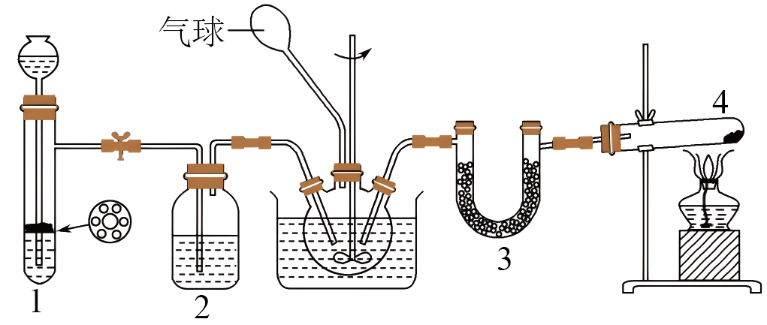〔图：1~4号串联实验装置图（1气体发生、2洗气瓶、3 U形管、4加热玻璃管，带气球搅拌装置）〕

（1）装置1用来制备二氧化碳气体：将块状石灰石放置在试管中的带孔塑料板上，漏斗中所加试剂为    ；装置2中所加试剂为    ；

（2）装置4中试剂为固体NH₄Cl和Ca(OH)₂，发生反应的化学方程式为        ；试管口不能向上倾斜的原因是          。装置3中试剂为KOH，其作用为              。

（3）反应时三颈瓶需用冷水浴冷却，其目的是                       。

【答案】     稀盐酸     浓H₂SO₄     Ca(OH)₂+2NH₄Cl=(Δ)=CaCl₂+2NH₃↑+2H₂O     防止冷凝水倒流到管底部使试管破裂     干燥剂(干燥氨气)     降低温度，使平衡正向移动提高产量

【解析】在装置1中稀盐酸与CaCO₃发生反应产生CO₂气体，在装置2中用浓硫酸干燥CO₂气体，将干燥的CO₂通入三颈烧瓶中；在装置4中Ca(OH)₂与NH₄Cl混合加热发生复分解反应产生NH₃，经装置3盛有KOH固体的干燥管干燥后通入三颈烧瓶中，与CO₂发生反应2NH₃(g)+CO₂(g)⇌NH₂COONH₄(s) △H<0，制取得到NH₂COONH₄。

（1）装置1用来制备二氧化碳气体，反应方程式为CaCO₃+2HCl=CaCl₂+CO₂↑+H₂O，在试管的带孔塑料板上放置块状CaCO₃，在长颈漏斗中放置稀盐酸；装置2中所加试剂为浓硫酸，作用是干燥CO₂气体；

（2）在装置4中试剂为固体NH₄Cl和Ca(OH)₂，二者混合加热发生反应制取氨气，发生反应的化学方程式为Ca(OH)₂+2NH₄Cl=(Δ)=CaCl₂+2NH₃↑+2H₂O；试管口不能向上倾斜的原因是：防止冷凝水倒流到管底部使试管破裂。装置3中试剂为KOH，其作用为干燥氨气。

（3）反应时三颈瓶需用冷水浴冷却，原因是2NH₃(g)+CO₂(g)⇌NH₂COONH₄(s) △H<0的正反应是放热反应，降低温度，化学平衡向放热的正反应方向移动，从而可提高产物的产量。

19．（2017·上海·高考真题）实验室通常用如图所示的装置来制取氨气。回答下列问题：

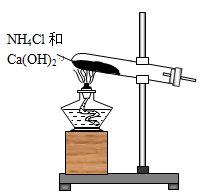〔图：NH₄Cl和Ca(OH)₂固体加热制取氨气的装置图〕

（1）安装仪器时要求试管口略低于试管底的原因是：                                             。

（2）制取氨气时的化学反应方程式为：                                           。

（3）收集氨气时必须使用干燥的集气装置的原因是                        。

（4）加热后将蘸有浓盐酸的玻璃棒靠近导管口，产生的现象是：                                                    。

（5）除氨气外，还可以用该装置制取的常见气体是                         。

【答案】     防止水倒流到试管底部，引起试管破裂     Ca(OH)₂+2NH₄Cl==CaCl₂+2H₂O+2NH₃↑     氨气极易溶于水     有白烟     氧气

【解析】（1）该反应中有水生成，如果水倒流能炸裂试管，易造成安全事故，故答案为防止水倒流到试管底部，引起试管破裂；

（2）实验室用加热氢氧化钙和氯化铵的方法制取氨气，加热条件下，氯化铵和氢氧化钙反应生成氯化钙、氨气和水，反应方程式为Ca(OH)₂+2NH₄Cl=(Δ)=CaCl₂ +2H₂O+2NH₃↑，故答案为Ca(OH)₂+2NH₄Cl=(Δ)=CaCl₂ +2H₂O+2NH₃↑；

（3）因为氨气极易溶于水，常温下1体积水中可溶700体积氨气，所以如果集气装置中有水，则氨气溶于水，得不到气体，故答案为氨气极易溶于水；

（4）氯化氢和氨气接触立即生成氯化铵固体，看到的现象是产生白烟，故答案为产生白烟；

（5）该反应装置是固体加热装置，只要是利用加热固体的方法制取的气体就可以用此装置，该装置还可以制取氧气、甲烷等气体，故答案为O₂。

20．（2015·广东·高考真题）NH₃及其盐都是重要的化工原料。

（1）用NH₄Cl和Ca（OH）₂制备NH₃，反应发生、气体收集和尾气处理装置依次为     。

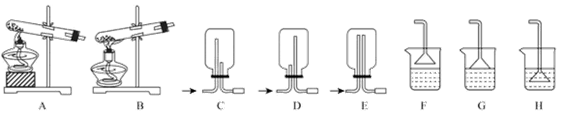〔图：A、B两种加热发生装置，C、D、E三种收集装置，F、G、H三种尾气吸收装置的选择图〕

（2）按下图装置进行NH₃性质实验。

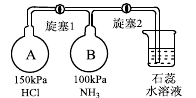〔图：A(150kPa HCl)、B(100kPa NH₃)两烧瓶经旋塞1、2连接并通入石蕊水溶液的喷泉实验装置图〕

> ①先打开旋塞1，B瓶中的现象是       ，原因是          ，稳定后，关闭旋塞1。
>
> ②再打开旋塞2，B瓶中的现象是                 。

（3）设计实验，探究某一种因素对溶液中NH₄Cl水解程度的影响。

限制试剂与仪器：固体NH₄Cl、蒸馏水、100mL容量瓶、烧杯、胶头滴管、玻璃棒、药匙、天平、pH计、温度计、恒温水浴槽（可控制温度）

> ①实验目的：探究      对溶液中NH₄Cl水解程度的影响。
>
> ②设计实验方案，拟定实验表格，完整体现实验方案（列出能直接读取数据的相关物理量及需拟定的数据，数据用字母表示；表中V（溶液）表示所配制溶液的体积）。

| 物理量 实验序号 | V（溶液）/mL |  |  |  | …… |
|---|---|---|---|---|---|
| 1 | 100 |  |  |  |  |
| 2 | 100 |  |  |  |  |

> ③按实验序号I所拟数据进行实验，若读取的待测物理量的数值为Y，则NH₄Cl水解反应得平衡转化率为     （只列出算式，忽略水自身电离的影响）。

【答案】     A．C．G     产生白烟     打开旋塞1，氯化氢与氨气混合反应生成了白色氯化铵固体小颗粒，形成白烟     烧杯中的石蕊溶液会倒流进入到B瓶中，形成红色溶液     温度（或浓度）     若探究温度对NH₄Cl水解程度的影响时数据为：

| 物理量 实验序号 | V（溶液）/mL | NH₄Cl质量（g） | 温度（℃） | pH | …… |
|---|---|---|---|---|---|
| 1 | 100 | m | T₁ | Y |  |
| 2 | 100 | m | T₂ | Z |  |

若探究浓度对NH₄Cl水解程度的影响时数据为：

| 物理量 实验序号 | V（溶液）/mL | NH₄Cl质量（g） | 温度（℃） | pH | …… |
|---|---|---|---|---|---|
| 1 | 100 | m₁ | T | Y |  |
| 2 | 100 | m₂ | T | Z |  |

（10⁻Y×5.35）/m

【解析】（1）NH₄Cl和Ca（OH）₂制备NH₃是固体混合物加热制取气体的反应，有水生成，试管口应向下倾斜，发生装置选A，NH₃密度比空气小，用向下排空气法收集，收集装置选C，氨气极易溶于水，要用防倒吸装置，但不能距离水太远，也不能插入液面以下，选G，故选A．C．G；

（2）①先打开旋塞1，B瓶中的现象是产生白色的烟；原因是先打开旋塞1，氯化氢与氨气挥发出来，氯化氢与氨气反应生成了氯化铵小颗粒，氯化铵小颗粒形成白烟；

②再打开旋塞2，B瓶中的现象是烧杯中的石蕊溶液会倒流进入到B瓶中，是因为气体参与反应后使得烧瓶内的压强变小，打开旋塞2后，大气压就会把烧杯中的溶液压到烧瓶中来，同时由于A中的HCl不可能全部进入B中，A中HCl过量，就算不能完全进入B瓶，B中的氨气也应能完全反应，形成氯化铵，石蕊溶液进入B中，B中的NH₄Cl溶于石蕊溶液，溶液显酸性，所以石蕊试液显红色；

（3）①主要采用控制变量的方法，根据给出的仪器，有可控制温度水浴槽，那么可以完成温度对NH₄Cl水解程度的影响，天平可以称出不同质量NH₄Cl，那么可以配制出不同浓度的溶液，就可以探究浓度对NH₄Cl水解程度的影响，故答案为温度或浓度。

①如果探究温度的影响那么控制浓度相同，改变温度，如果探究浓度相同，那么就要控制温度相同，不管哪一种探究都需要配制一定浓度的NH₄Cl溶液，那么需要称量NH₄Cl的质量，但不管探究的是哪种因素的影响，都需要使用pH计通过测量水解后溶液的pH来判断其水解程度，所以在表格中都应有一项为pH值。

若探究温度对NH₄Cl水解程度的影响时数据为：

| 物理量 实验序号 | V（溶液）/mL | NH₄Cl质量（g） | 温度（℃） | pH | …… |
|---|---|---|---|---|---|
| 1 | 100 | m | T₁ | Y |  |
| 2 | 100 | m | T₂ | Z |  |

若探究浓度对NH₄Cl水解程度的影响时数据为：

| 物理量 实验序号 | V（溶液）/mL | NH₄Cl质量（g） | 温度（℃） | pH | …… |
|---|---|---|---|---|---|
| 1 | 100 | m₁ | T | Y |  |
| 2 | 100 | m₂ | T | Z |  |

如果pH为Y，那么c（H⁺）=10⁻Ymol/L，物质的量为10⁻Ymol/L×0.1L=10⁻Y⁻¹mol，那么水解的NH₄Cl的物质的量也为10⁻Y⁻¹mol，质量为10⁻Y⁻¹mol×53.5g/mol=10⁻Y×5.35g，则NH₄Cl水解反应得平衡转化率为:（10⁻Y×5.35）/m。

21．（2010·海南·高考真题）根据氨气还原氧化铜的反应，可设计测定铜元素相对原子质量Ar（Cu） (近似值)的实验。先称量反应物氧化铜的质量m(CuO)，反应完全后测定生成物水的质量m(H₂O)，由此计算Ar（Cu）。为此，提供的实验仪器及试剂如下(根据需要可重复选用，加入的NH₄Cl与Ca(OH)₂的量足以产生使CuO完全还原的氨气)：

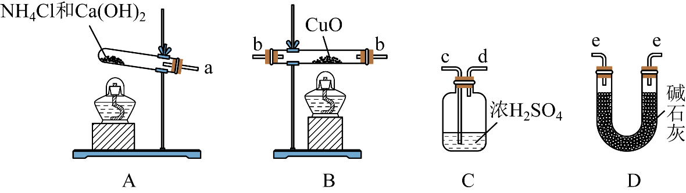〔图：A NH₄Cl和Ca(OH)₂加热装置；B CuO加热玻璃管；C 浓H₂SO₄洗气瓶；D 碱石灰U形管〕

请回答下列问题：

（1）氨气还原炽热氧化铜的化学方程式为                                ；

（2）从所提供的仪器及试剂中选择并组装本实验的一套合理、简单的装置，按气流方向的连接顺序为(用图中标注的导管口符号表示)a→                              ；

（3）在本实验中，若测得m(CuO)=ag，m(H₂O)=bg，则Ar（Cu）=                ；

（4）在本实验中，使测定结果Ar（Cu）偏大的是                (填序号)；

> ①CuO未完全起反应 ② CuO不干燥
>
> ③CuO中混有不反应的杂质 ④碱石灰不干燥
>
> ⑤NH₄Cl与Ca(OH)₂混合物不干燥

（5）在本实验中，还可通过测定               和               ，或               和               达到实验目的。

【答案】     2NH₃+ 3CuO=(Δ)=3Cu + 3H₂O + N₂     a→ e→ b→ e     (18a)/(b)-16     ①③     m(CuO)     m(Cu)     m(Cu)     m(H₂O)

【解析】（1）氨气具有弱还原性，在加热条件下可以被氧化铜氧化，生成物为氮气、铜和水，反应的化学方程式为2NH₃+3CuO=(Δ)=3Cu+3H₂O+N₂；

（2）因为需要测定反应后生成物水的质量，所以必需保证通入的氨气是纯净干燥的，由于浓硫酸可以与氨气反应，因此只能通过碱石灰进行干燥，再通入氧化铜进行反应，最后再通入碱石灰吸收反应生成的水，以测得生成水的质量，所以正确的顺序为a→e→b→e；

（3）根据反应方程式2NH₃+3CuO=(Δ)=3Cu+3H₂O+N₂可知，氧化铜和水的物质的量相等，所以有以下关系式：(ag)/(Ar(Cu)+16)=(bg)/(18)，解得Ar(Cu)=(18a)/(b)－16；

（4）由（3）可知得Ar(Cu)=(18a)/(b)－16，①若CuO未完全起反应，说明b偏小，结果偏大；②若CuO不干燥，说明a偏小，b偏大，结果偏低；③若CuO中混有不反应的杂质，说明b偏小，结果偏大；④若碱石灰不干燥，说明氨气干燥不彻底，b偏大，结果偏低；⑤若NH₄Cl与Ca（OH）₂混合物不干燥，但只要氨气干燥彻底，对结果不影响；故答案为①③；

（5）根据反应方程式2NH₃+3CuO=(Δ)=3Cu+3H₂O+N₂可知，也可以通过测定m（CuO）和m（Cu）或m（Cu）和m（H₂O）来达到实验目的，故答案为m（CuO）和m（Cu）或m（Cu）和m（H₂O）。

22．（2010·重庆·高考真题）某兴趣小组用下图装置探究氨的催化氧化

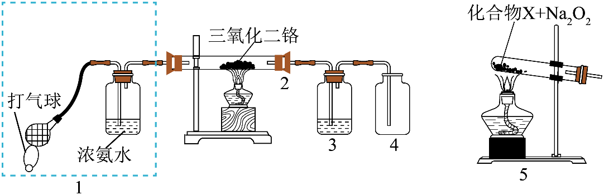〔图：氨催化氧化实验装置图（1打气球+浓氨水、2三氧化二铬加热管、3吸收瓶、4集气瓶、5化合物X+Na₂O₂加热装置）〕

（1）氨催化氧化的化学方程式为                   。

（2）加热玻璃管2一段时间后，挤压1中打气球鼓入空气，观察到2中物质呈红热状态；停止加热后仍能保持红热，该反应         热量（填“吸收”或“放出”）。

（3）为保证在装置4中观察到红棕色气体，装置3应装入         ；若取消3，在4中仅观察到大量白烟，原因是                   。

（4）为实现氨催化氧化，也可用装置5替换装置         （填装置代号）；化合物X为         （只写一种），Na₂O₂的作用是                   。

【答案】     4NH₃+5O₂=(Δ/催化剂)=4NO+6H₂O     放出     浓H₂SO₄     生成的NO与O₂反应生成NO₂，NO₂与水反应生成HNO₃，NH₃与HNO₃反应生成了NH₄NO₃     1     NH₄Cl     与HCl反应生成氧气

【解析】（1）NH₃发生催化氧化生成NO和H₂O，反应的化学方程式为4NH₃+5O₂=(Δ/催化剂)=4NO+6H₂O。

（2）加热玻璃管2一段时间后，挤压1中打气球鼓入空气，观察到2中物质呈红热状态；停止加热后仍能保持红热，说明该反应放出热量，能维持反应的进行。

（3）为保证在装置4中观察到红棕色气体，装置3中盛放的物质能吸收未反应的NH₃和反应生成的H₂O（g），装置3应装入浓硫酸；若取消3，在4中仅观察到大量白烟的原因是：氨催化氧化生成的NO与O₂反应生成NO₂，NO₂与水反应生成HNO₃，NH₃与HNO₃反应生成了NH₄NO₃产生白烟。

（4）装置5应能产生NH₃和O₂的混合气，则装置5用于替换装置1；化合物X受热能产生NH₃、且产物能与Na₂O₂作用产生O₂，故化合物X可以为NH₄Cl，NH₄Cl加热分解得NH₃和HCl，而HCl与Na₂O₂反应生成O₂。

23．（2009·全国·高考真题）已知氨可以与灼热的氧化铜反应得到氮气和金属铜，用示意图中的装置可以实现该反应。

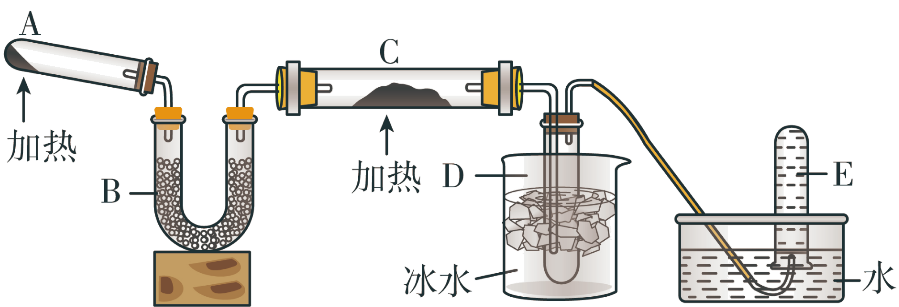〔图：A~E实验装置图（A加热、B U形干燥管、C加热反应管、D冰水冷却、E排水集气）〕

回答下列问题：

（1）A中加入的物质是                                         .

发生反应的化学方程式是                                     ;

（2）B中加入的物质是            ，其作用是                        :

（3）实验时在C中观察到得现象是                             ，

发生反应的化学方程式是                                   ;

（4） 实验时在D中观察到得现象是                                 ，

D中收集到的物质是             ,检验该物质的方法和现象是                    .

【答案】     固体NH₄Cl和Ca(OH)₂     2NH₄Cl+Ca(OH)₂=(Δ)=CaCl₂+2NH₃↑+2H₂O     碱石灰     除去氨气中的水蒸气     黑色粉末逐渐变为红色     2NH₃+3CuO=(Δ)=N₂+3H₂O+3Cu     出现无色液体     氨水     用红色石蕊试纸检验，试纸变蓝，用无水硫酸铜检验，无水硫酸铜变蓝

【解析】根据实验目的，氨气与灼热的氧化铜反应得到氮气和金属铜，所以A处是产生氨气的反应，用氯化铵和氢氧化钙来制取氨气，氨气中混有水蒸气，用碱石灰干燥，氨气易液化，极易吸收水成为氨水，氨水具有碱性，能使红色石蕊试纸变蓝，其中的结晶水会使无水硫酸铜变蓝。

（1）根据实验目的，氨气与灼热的氧化铜反应得到氮气和金属铜，可知A中加入的是氯化铵和氢氢化钙的固体混合物，加热来制取氨气，发生反应的化学方程式是：2NH₄Cl+Ca(OH)₂=(Δ)=CaCl₂+2NH₃↑+2H₂O，故答案为固体NH₄Cl和Ca(OH)₂；2NH₄Cl+Ca(OH)₂=(Δ)=CaCl₂+2NH₃↑+2H₂O；

（2）制得的氨气中含有杂质水，可以用碱石灰来吸收，故答案为碱石灰；除去氨气中的水蒸气；

（3）氨气和氧化铜在加热的条件下发生反应生成金属铜、水以及氮气，反应方程式为2NH₃+3CuO=(Δ)=N₂+3H₂O+3Cu，黑色粉未逐渐变为红色，故答案为黑色粉末逐渐变为红色；2NH₃+3CuO=(Δ)=N₂+3H₂O+3Cu；

（4）氨气还原氧化铜之后剩余的氨气和产生的水蒸气在冷凝时会形成氨水，氨水可以使红色石蕊试纸变蓝，水会使无水硫酸铜变蓝，故答案为出现无色液体；氨水；用红色石蕊试纸检验，试纸变蓝，用无水硫酸铜检验，无水硫酸铜变蓝。

考点03 硝酸及硝酸盐

1．（2025·广东·高考真题）按如图组装装置并进行实验：将铜丝插入溶液中，当c中红色褪去时，将铜丝拔离液面。下列叙述错误的是

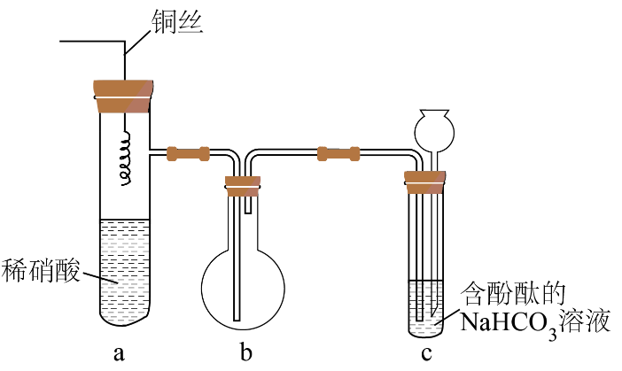〔图：a试管（铜丝插入稀硝酸）连接b圆底烧瓶、c试管（含酚酞的NaHCO₃溶液）的装置图〕

> A．a中有化合反应发生，并有颜色变化
>
> B．b中气体变红棕色时，所含氮氧化物至少有两种
>
> C．c中溶液红色刚好褪去时，HCO₃⁻恰好完全反应
>
> D．若将a中稀硝酸换为浓硫酸并加热，则c中溶液颜色会褪去

【答案】C

【解析】A．铜和稀硝酸反应，会生成一氧化氮，一氧化氮为无色气体，液面上方有氧气存在，一氧化氮与氧气反应，生成红棕色的二氧化氮，属于化合反应，生成Cu(NO₃)₂为蓝色，有颜色变化，A正确；B．b中气体变红棕色时，说明有二氧化氮存在，存在2NO₂⇌N₂O₄的反应，所以所含氮氧化物至少有两种，B正确；C．酚酞的变色范围是8.2~10，c中溶液红色刚好褪去时，此时溶液可能呈弱碱性，所以不能判断HCO₃⁻是否恰好完全反应，C错误；D．若将a中稀硝酸换为浓硫酸并加热，会生成二氧化硫，二氧化硫通入碳酸氢钠溶液中，可生成亚硫酸氢钠，溶液显酸性，c中溶液颜色会褪去，D正确；故选C。

2．（2025·云南·高考真题）某化学兴趣小组设计如下实验装置，通过测定反应前后质量的变化，验证NaNO₃固体在酒精灯加热条件下，受热分解的气态产物。

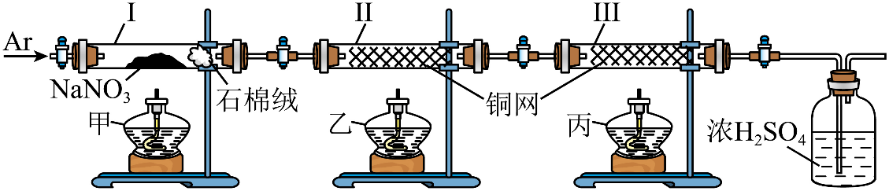〔图：Ar气流中NaNO₃加热分解并经三段铜网（Ⅰ、Ⅱ、Ⅲ，甲乙丙加热）再用浓H₂SO₄吸收的装置图〕

实验步骤：先缓慢通入Ar气，排尽装置内空气；关闭Ⅰ左侧阀门，点燃酒精灯；一段时间后，Ⅱ中灼热的铜网变黑，熄灭酒精灯甲；再次缓慢通入Ar气……

下列说法错误的是

> A．实验步骤中，点燃酒精灯的顺序为甲、乙、丙
>
> B．整个过程中，若Ⅲ中灼热的铜网未变黑，则说明生成的O₂在Ⅱ中反应完全
>
> C．实验结束后，若Ⅰ中减少的质量等于Ⅱ中增加的质量，则分解的气态产物只有O₂
>
> D．NaNO₃应远离热源、可燃物，并与还原性物质分开存放

【答案】A

【解析】先缓慢通入Ar气，排尽装置内空气，防止对实验造成干扰，关闭Ⅰ左侧阀门，先后点燃乙、丙、甲处酒精灯，一段时间后，Ⅰ中灼热的铜网变黑，说明NaNO₃分解产生了O₂，熄灭酒精灯甲，再次缓慢通入Ar气，使NaNO₃分解产生的气态产物全部排尽，浓硫酸用于防止空气中的水蒸气进入装置干扰实验。A．一段时间后，Ⅱ中灼热的铜网变黑，说明NaNO₃分解产生了O₂，为确保能准确测定产生的氧气的质量，应先点燃乙处酒精灯，再点燃丙处酒精灯，最后点燃甲处酒精灯，A错误；B．Ⅱ、Ⅲ中Cu均能和氧气反应生成黑色的CuO，整个过程中，若Ⅱ中灼热的铜网未变黑，则说明生成的O₂在Ⅱ中反应完全，B正确；C．Ⅱ中的Cu只能吸收O₂，实验结束后，若Ⅰ中减少的质量等于Ⅰ中增加的质量，则分解的气态产物只有O₂，C正确；D．由该实验可知NaNO₃受热易分解产生氧化剂、助燃性气体O₂，故NaNO₃应远离热源、可燃物，并与还原性物质分开存放，D正确；答案选A。

3．（2024·湖南·高考真题）某学生按图示方法进行实验，观察到以下实验现象：

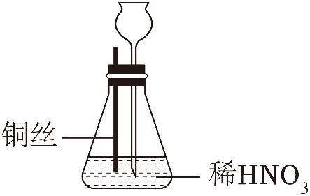〔图：锥形瓶内铜丝与稀HNO₃反应、插长颈漏斗的装置图〕

> ①铜丝表面缓慢放出气泡，锥形瓶内气体呈红棕色；
>
> ②铜丝表面气泡释放速度逐渐加快，气体颜色逐渐变深；
>
> ③一段时间后气体颜色逐渐变浅，至几乎无色；
>
> ④锥形瓶中液面下降，长颈漏斗中液面上升，最终铜丝与液面脱离接触，反应停止。

下列说法正确的是

> A．开始阶段铜丝表面气泡释放速度缓慢，原因是铜丝在稀HNO₃中表面钝化
>
> B．锥形瓶内出现了红棕色气体，表明铜和稀HNO₃反应生成了NO₂
>
> C．红棕色逐渐变浅的主要原因是3NO₂+H₂O=2HNO₃+NO
>
> D．铜丝与液面脱离接触，反应停止，原因是硝酸消耗完全

【答案】C

【解析】A．金属铜与稀硝酸不会产生钝化。开始反应速率较慢，可能的原因是反应温度较低，故A项说法错误；B．由于装置内有空气，铜和稀HNO₃反应生成的NO迅速被氧气氧化为红棕色的NO₂，产生的NO₂浓度逐渐增加，气体颜色逐渐变深，故B项说法错误；C．装置内氧气逐渐被消耗，生成的NO₂量逐渐达到最大值，同时装置内的NO₂能与溶液中的H₂O反应3NO₂+H₂O=2HNO₃+NO，气体颜色变浅，故C项说法正确；D．由于该装置为密闭体系，生成的NO无法排出，逐渐将锥形瓶内液体压入长颈漏斗，铜丝与液面脱离接触，反应停止，故D项说法错误；答案选C。

4．（2022·北京·高考真题）利用如图所示装置(夹持装置略)进行实验，b中现象不能证明a中产物生成的是

|  | a中反应 | b中检测试剂及现象 | 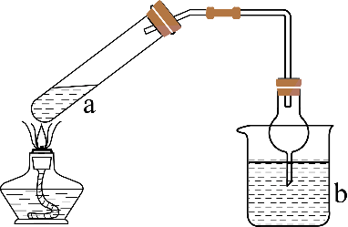〔图：a试管加热，导管经球形干燥管通入b烧杯液面下的装置图〕 |
|---|---|---|---|
| A | 浓HNO₃分解生成NO₂ | 淀粉-KI溶液变蓝 |  |
| B | Cu与浓H₂SO₄生成SO₂ | 品红溶液褪色 |  |
| C | 浓NaOH与NH₄Cl溶液生成NH₃ | 酚酞溶液变红 |  |
| D | CH₃CHBrCH₃与NaOH乙醇溶液生成丙烯 | 溴水褪色 |  |

【答案】A

【解析】A．浓硝酸具有挥发性，挥发出的硝酸也能与碘化钾溶液反应生成遇淀粉溶液变蓝色的碘，则淀粉碘化钾溶液变蓝色不能说明浓硝酸分解生成二氧化氮，故A符合题意；B．铜与浓硫酸共热反应生成的二氧化硫具有漂白性，能使品红溶液褪色，则品红溶液褪色能说明铜与浓硫酸共热反应生成二氧化硫，故B不符合题意；C．浓氢氧化钠溶液与氯化铵溶液共热反应生成能使酚酞溶液变红的氨气，则酚酞溶液变红能说明浓氢氧化钠溶液与氯化铵溶液共热反应生成氨气，故C不符合题意；D．乙醇具有挥发性，挥发出的乙醇不能与溴水反应，则2—溴丙烷与氢氧化钠乙醇溶液共热发生消去反应生成能使溴水褪色的丙烯气体，则溴水褪色能说明2—溴丙烷与氢氧化钠乙醇溶液共热发生消去反应生成丙烯，故D不符合题意；故选A。

5．（2017·北京·高考真题）下述实验中均有红棕色气体产生，对比分析所得结论不正确的是

| 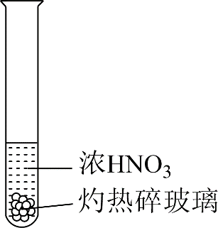〔图：试管内浓HNO₃与灼热碎玻璃的实验图〕 | 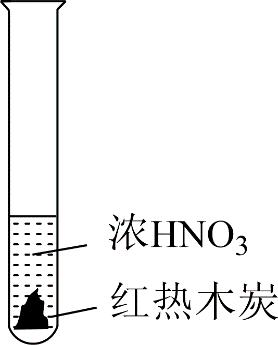〔图：试管内浓HNO₃与红热木炭的实验图〕 | 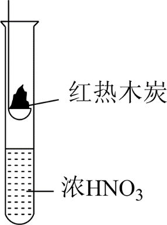〔图：燃烧匙中红热木炭伸入盛浓HNO₃试管的实验图〕 |
|---|---|---|
| ① | ② | ③ |

> A．由①中的红棕色气体，推断产生的气体一定是混合气体
>
> B．由②中的红棕色气体不能表明木炭与浓硝酸发生了反应
>
> C．由③说明浓硝酸具有挥发性，生成的红棕色气体为还原产物
>
> D．③的气体产物中检测出CO₂，由此说明木炭一定与浓硝酸发生了反应

【答案】D

【解析】浓硝酸不稳定，易分解为二氧化氮、水和氧气。A．①中的红棕色气体是NO₂，N元素化合价降低，根据氧化还原反应规律，一定有元素化合价升高，推断产生的气体中还一定有O₂，故A正确；B．浓硝酸受热易分解，②中的红棕色气体可能是硝酸分解产生，不能说明木炭与浓硝酸发生了反应，故B正确；C．硝酸中N元素化合价为+5价，生成二氧化氮中N元素化合价为+4价，化合价降低，所以生成的红棕色气体为还原产物，故C正确；D．③的气体产物中检测出CO₂，CO₂可能是C和氧气反应生成的产物，故D错误；选D。

6．（2022·浙江·高考真题）亚硝酸钠俗称“工业盐”，其外观、口感与食盐相似，人若误服会中毒。现将适量某样品(成分为亚硝酸钠或氯化钠)溶于水配成溶液，分别取少量该溶液于试管中进行实验。下列方案设计、现象和结论都正确的是

|  | 方案设计 | 现象和结论 |
|---|---|---|
| A | 先加入少量KClO₃溶液，再加AgNO₃溶液和足量稀硝酸，振荡 | 若产生白色沉淀，则样品为亚硝酸钠 |
| B | 加到少量KMnO₄溶液中，再加硫酸酸化，振荡 | 若溶液褪色，则样品为亚硝酸钠 |
| C | 先加到少量FeCl₂溶液中，再加入稀盐酸酸化，振荡 | 若溶液变黄色，则样品为亚硝酸钠 |
| D | 先加入少量Na₂SO₃溶液，再加入BaCl₂溶液和稀硝酸，振荡 | 若产生白色沉淀，则样品为亚硝酸钠 |

【答案】C

【解析】A．样品若为NaCl，依然会出现白色沉淀，A错误；B．氯化钠电离出的氯离子也可以被酸性高锰酸钾氧化，而使其褪色，B错误；C．亚硝酸有氧化性，可以把二价铁氧化为三价铁，溶液变为黄色，C正确；D．稀硝酸可以把亚硫酸根离子氧化为硫酸根离子，再加入氯化钡可以生成硫酸钡白色沉淀，D错误；故选C。

7．（2015·新课标Ⅰ·高考真题）我国清代《本草纲目拾遗》中记叙无机药物335种，其中“强水”条目下写道：“性最烈，能蚀五金……其水甚强，五金八石皆能穿第，惟玻璃可盛。”这里的“强水”是指

> A．氨水 B．硝酸 C．醋 D．卤水

【答案】B

【解析】根据题意该物质能够与很多金属反应，根据选项B最符合，该强水为硝酸，硝酸具有强氧化性，可溶解大部分金属；答案选B。

8．（2007·四川·高考真题）足量铜与一定量浓硝酸反应得到硝酸铜溶液和NO₂、N₂O₄、NO 的混合气体，这些气体与1.68LO₂（标准状况）混合后通入水中，所有气体完全被水吸收生成硝酸。若向所得硝酸铜溶液中加入5mol/LNaOH溶液至Cu²⁺恰好完全沉淀，则消耗NaOH溶液的体积是

> A．60mL B．45mL C．30mL D．15mL

【答案】A

【解析】从题叙述可以看出，铜还原硝酸得到的气体，恰好又与1.68 L O₂完全反应，所以可以使用电子得失守恒先求n(Cu)，即n(Cu)×2＝n(O₂)×4，得n(Cu)＝2n(O₂)＝2×(1.68L)/(22.4L/mol)＝0.15 mol，所以这些铜对应的铜离子恰好沉淀所需n(NaOH)应为0.3 mol，所需V(NaOH)应为60 mL，故选A。

9．（2015·上海·高考真题）下列物质见光不会分解的是

> A．HClO B．NH₄Cl C．HNO₃ D．AgNO₃

【答案】B

【解析】A．HClO不稳定，光照发生分解反应产生HCl和O₂，反应方程式是：2HClO=(光)=2HCl+O₂↑，错误；B．NH₄Cl在加热时发生分解反应，而在光照时不会分解，正确；C．HNO₃不稳定，在加热或光照时发生分解反应，方程式是：4HNO₃(浓)=(Δ)=4NO₂↑+ O₂↑＋2H₂O，错误；D．AgNO₃不稳定，光照发生分解反应，方程式是：2AgNO₃=(Δ)=2Ag+2NO₂↑+ O₂↑，错误。

10．（2015·北京·高考真题）在通风橱中进行下列实验：

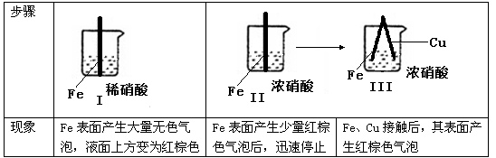〔图：Fe、Cu与稀硝酸、浓硝酸反应的三步骤（Ⅰ、Ⅱ、Ⅲ）现象对比图〕

下列说法中不正确的是：

> A．Ⅰ种气体有无色变红棕色的化学方程式为：2NO+O₂=2NO₂
>
> B．Ⅱ中的现象说明Fe表面形成致密的氧化层，阻止Fe进一步反应
>
> C．对比Ⅰ、Ⅱ中现象，说明稀HNO₃的氧化性强于浓HNO₃
>
> D．针对Ⅲ中现象，在Fe、Cu之间连接电流计，可判断Fe是否被氧化

【答案】C

【解析】A．I是铁与稀硝酸反应生成无色气体NO，NO被空气中的氧气氧化生成红棕色的NO₂气体，故A正确；B．II的现象是因为铁发生了钝化，Fe表面形成致密的氧化层，阻止Fe进一步反应，故B正确；C．实验II反应停止是因为发生了钝化，不能用来比较稀硝酸和浓硝酸的氧化性强弱，物质氧化性强弱只能通过比较物质得电子能力大小来分析，故C错误；D．III中Fe、Cu都能与硝酸反应，二者接触，符合原电池构成条件，要想验证铁是否为负极，发生氧化反应，可以连接电流计，故D正确。答案选C。

11．（2012·北京·高考真题）用右图所示装置进行下列实验，实验结果与预测的现象不一致的是

|  | ①中的物质 | ②中的物质 | 预测①中现象 | 〔图：倒扣容器内并排放置①、②两个小烧杯的装置图〕 |
|---|---|---|---|---|
| A | 淀粉碘化钾溶液 | 浓硝酸 | 无明显现象 |  |
| B | 酚酞溶液 | 浓盐酸 | 无明显现象 |  |
| C | 氯化铝溶液 | 浓氨水 | 有白色沉淀 |  |
| D | 湿润红纸条 | 饱和氯水 | 红纸条褪色 |  |

【答案】A

【解析】A．硝酸具有挥发性，挥发出的硝酸进入淀粉KI溶液，硝酸具有强氧化性，可以将KI氧化为I₂，I₂遇淀粉变蓝色，故A错误；B．浓盐酸具有挥发性，挥发出的HCl进入酚酞溶液，酚酞溶液在酸性条件下不变色，故B正确；C．浓氨水具有挥发性，挥发出的氨气溶于氯化铝溶液，一水合氨与氯化铝反应生成氢氧化铝白色沉淀，故C正确；D．饱和氯水挥发出氯气，氯气与湿润红纸条接触，氯气水反应生成HClO，HClO具有漂白性，使湿润红纸条褪色，故D正确；故答案为A。

12．（2024·北京·高考真题）HNO₃是一种重要的工业原料。可采用不同的氮源制备HNO₃。

（1）方法一：早期以硝石(含NaNO₃)为氮源制备HNO₃，反应的化学方程式为：H₂SO₄(浓)+NaNO₃=NaHSO₄+HNO₃↑。该反应利用了浓硫酸的性质是酸性和       。

（2）方法二：以NH₃为氮源催化氧化制备HNO₃，反应原理分三步进行。

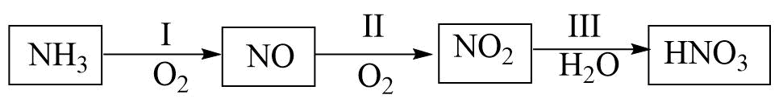〔图：NH₃经Ⅰ(O₂)、Ⅱ(O₂)、Ⅲ(H₂O)转化为NO、NO₂、HNO₃的流程图〕

> ①第I步反应的化学方程式为       。
>
> ②针对第Ⅱ步反应进行研究：在容积可变的密闭容器中，充入2nmolNO和n mol O₂进行反应。在不同压强下(p₁、p₂)，反应达到平衡时，测得NO转化率随温度的变化如图所示。解释y点的容器容积小于x点的容器容积的原因       。

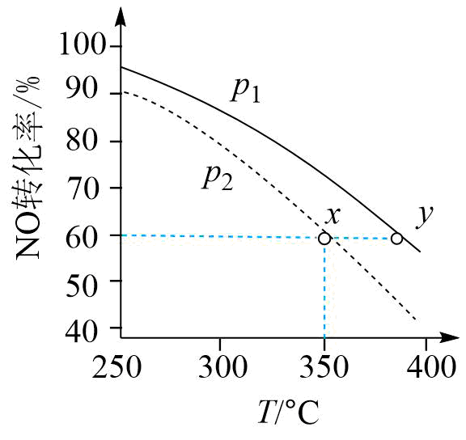〔图：NO平衡转化率随温度变化曲线图（p₁、p₂两条曲线，标注x、y点）〕

（3）方法三：研究表明可以用电解法以N₂为氮源直接制备HNO₃，其原理示意图如下。

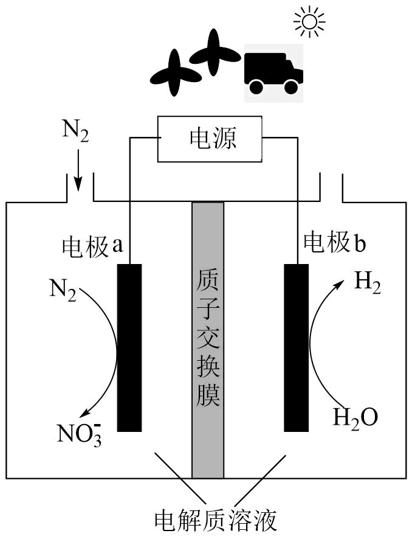〔图：电解固氮装置示意图（电极a上N₂→NO₃⁻，电极b上H₂O→H₂，中间质子交换膜，外接电源）〕

> ①电极a表面生成NO₃⁻的电极反应式：       。
>
> ②研究发现：N₂转化可能的途径为N₂=(i)=NO=(ii)=NO₃⁻。电极a表面还发生iii．H₂O→O₂。iii的存在，有利于途径ii，原因是       。

（4）人工固氮是高能耗的过程，结合N₂分子结构解释原因       。方法三为N₂的直接利用提供了一种新的思路。

【答案】（1）难挥发性

（2）     4NH₃+5O₂=(催化剂/Δ)=4NO+6H₂O     2NO+O₂⇌2NO₂，该反应正向气体分子总数减小，同温时，p₁条件下NO转化率高于p₂，故p₁>p₂，x、y点转化率相同，此时压强对容积的影响大于温度对容积的影响

（3）     N₂-10e⁻+6H₂O=2NO₃⁻+12H⁺     反应iii生成O₂，O₂将NO氧化成NO₂，NO₂更易转化成NO₃⁻

（4）N₂中存在氮氮三键，键能高，断键时需要较大的能量，故人工固氮是高能耗的过程

【解析】（1）浓硫酸难挥发，产物HNO₃为气体，有利于复分解反应进行，体现了浓硫酸的难挥发性和酸性。

（2）①第I步反应为氨气的催化氧化，化学方程式为4NH₃+5O₂=(催化剂/Δ)=4NO+6H₂O；

②2NO+O₂⇌2NO₂，该反应正向气体分子总数减小，同温时，p₁条件下NO转化率高于p₂，故p₁>p₂，根据V=nR(T)/(p)，x、y点转化率相同，则n相同，此时压强对容积的影响大于温度对容积的影响，故y点的容器容积小于x点的容器容积。

（3）①由电极a上的物质转化可知，氮元素化合价升高，发生氧化反应，电极a为阳极，电极反应式为N₂-10e⁻+6H₂O=2NO₃⁻+12H⁺；

②反应iii生成O₂，O₂将NO氧化成NO₂，NO₂更易转化成NO₃⁻。

（4）N₂中存在氮氮三键，键能高，断键时需要较大的能量，故人工固氮是高能耗的过程。

13．（2022·海南·高考真题）磷酸氢二铵[(NH₄)₂HPO₄]常用于干粉灭火剂。某研究小组用磷酸吸收氨气制备(NH₄)₂HPO₄，装置如图所示(夹持和搅拌装置已省略)。

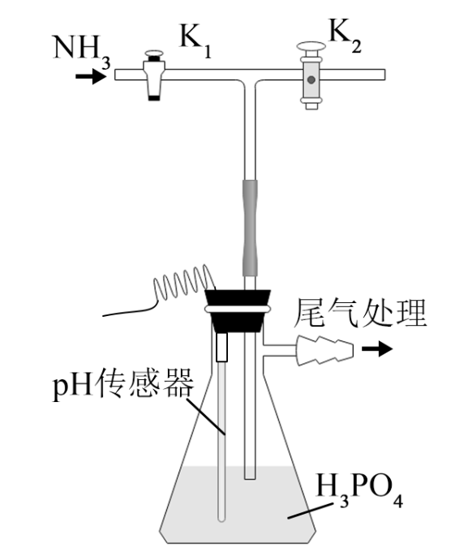〔图：NH₃经K₁、K₂旋塞通入盛H₃PO₄的锥形瓶（含pH传感器、尾气处理）的装置图〕

回答问题：

（1）实验室用NH₄Cl(s)和Ca(OH)₂(s)制备氨气的化学方程式为       。

（2）现有浓H₃PO₄质量分数为85%，密度为1.7g/mL。若实验需100mL1.7mol/L的H₃PO₄溶液，则需浓H₃PO₄       mL(保留一位小数)。

（3）装置中活塞K₂的作用为       。实验过程中，当出现       现象时，应及时关闭K₁，打开K₂。

（4）当溶液pH为8.0~9.0时，停止通NH₃，即可制得(NH₄)₂HPO₄溶液。若继续通入NH₃，当pH>10.0时，溶液中OH⁻、       和       (填离子符号)浓度明显增加。

（5）若本实验不选用pH传感器，还可选用       作指示剂，当溶液颜色由       变为       时，停止通NH₃。

【答案】（1）2NH₄Cl+Ca(OH)₂=(Δ)=CaCl₂+2H₂O+2NH₃↑

（2）11.5

（3）     平衡气压防倒吸     倒吸

（4）     NH₄⁺     PO₄³⁻

（5）     酚酞     无     浅红

【解析】本实验的实验目的为制备磷酸二氢铵[(NH₄)₂HPO₄]，实验原理为2NH₃+H₃PO₄=[(NH₄)₂HPO₄]，结合相关实验基础知识分析解答问题。

【解析】（1）实验室用NH₄Cl(s)和Ca(OH)₂(s)在加热的条件下制备氨气，反应的化学方程式为2NH₄Cl+Ca(OH)₂=(Δ)=CaCl₂+2H₂O+2NH₃↑；

（2）根据公式c=(1000ρω)/(M)可得，浓H₃PO₄的浓度c=(1000ρω)/(M)=(1000×1.7g⋅mL⁻¹×85%)/(98)≈14.7mol/L，溶液稀释前后溶质的物质的量不变，因此配制100mL 1.7mol/L的H₃PO₄溶液，需要浓H₃PO₄的体积V=(0.1L×1.7mol/L)/(14.7mol/L)≈0.0115L=11.5mL；

（3）由于NH₃极易溶于水，因此可选择打开活塞K₂以平衡气压，防止发生倒吸，所以实验过程中，当出现倒吸现象时，应及时关闭K₁，打开K₂；

（4）继续通入NH₃，(NH₄)₂HPO₄继续反应生成(NH₄)₃PO₄，当pH＞10.0时，溶液中OH⁻、NH₄⁺、PO₄³⁻的浓度明显增加；

（5）由（4）小问可知，当pH为8.0~9.0时，可制得(NH₄)₂HPO₄，说明(NH₄)₂HPO₄溶液显碱性，因此若不选用pH传感器，还可以选用酚酞作指示剂，当溶液颜色由无色变为浅红时，停止通入NH₃，即可制得(NH₄)₂HPO₄溶液。

14．（2009·北京·高考真题）某学习小组探究浓、稀硝酸氧化性的相对强弱，按下图装置进行实验（夹持仪器已略去）。实验表明浓硝酸能将NO氧化成NO₂，而稀硝酸不能氧化NO。由此得出的结论是浓硝酸的氧化性强于稀硝酸。

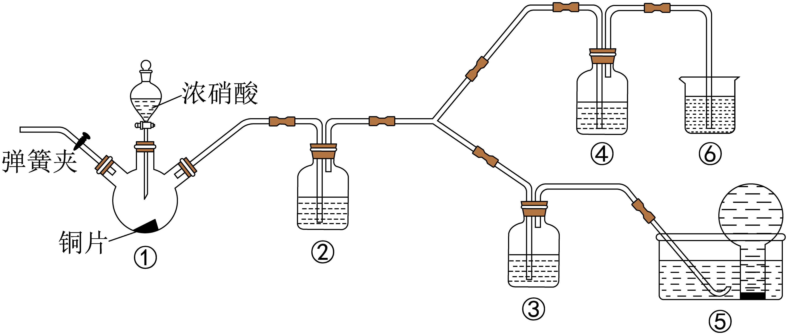〔图：①铜片与浓硝酸三颈烧瓶发生装置，②③④洗气瓶，⑤排水集气装置，⑥烧杯的串联装置图〕

可选药品：浓硝酸、3mo/L稀硝酸、蒸馏水、浓硫酸、氢氧化钠溶液及二氧化碳

已知：氢氧化钠溶液不与NO反应，能与NO₂反应，2NO₂＋2NaOH=NaNO₃＋NaNO₂＋H₂O。

（1）实验应避免有害气体排放到空气中，装置③、④、⑥中盛放的药品依次是

（2）滴加浓硝酸之前的操作时检验装置的气密性，加入药品，打开弹簧夹后

（3）装置①中发生反应的化学方程式是

（4）装置②的作用是        ，发生反应的化学方程式是

（5）该小组得出的结论依据的实验现象是

（6）实验结束后，同学们发现装置①中溶液呈绿色，而不显蓝色。甲同学认为是该溶液中硝酸铜的质量分数较高所致，而乙同学认为是该溶液中溶解了生成的气体。同学们分别设计了以下4个实验来判断两种看法是否正确。这些方案中可行的是（选填序号字母）(     )

> A．加热该绿色溶液，观察颜色变化
>
> B．加水稀释绿色溶液，观察颜色变化
>
> C．向该绿色溶液中通入氮气，观察颜色变化
>
> D．向饱和硝酸铜溶液中通入浓硝酸与铜反应产生的气体，观察颜色变化

【答案】     3mol/L稀硝酸、浓硝酸、氢氧化钠溶液     通入CO₂一段时间，关闭弹簧夹，将装置⑤中导管末端伸入倒置的烧瓶内     Cu + 4HNO₃(浓)= Cu(NO₃)₂+ 2NO₂↑ + 2H₂O     将NO₂转化为NO     3NO₂ + H₂O =2HNO₃ + NO     装置③中液面上方气体仍为无色，装置④中液面上方气体由无色变为红棕色     acd

【解析】要验证浓硝酸可以将NO氧化成NO₂，而稀硝酸不可以。装置①为铜和浓硝酸反应生成NO₂的装置，经②与水发生反应生成NO，再分别通过浓硝酸和稀硝酸，进行验证试验；由于氮氧化物均为有毒物质，所以均需要尾气处理。

（1）氮氧化物均为有毒气体，均需要尾气处理，根据已知，NO不能被NaOH吸收，而NO₂可以，则装置⑥为NaOH吸收NO₂的装置，则④中盛放的为浓硝酸，将NO氧化成NO₂，装置③中为稀硝酸，不能将NO氧化，而NO不溶于水，排水法收集。答案为3mol/L稀硝酸、浓硝酸、氢氧化钠溶液；

（2）由于装置中残存的空气能氧化NO而对实验产生干扰，所以滴加浓HNO₃之前需要通入一段时间CO₂赶走装置中的空气，同时也需将装置⑤中导管末端伸入倒置的烧瓶内防止反应产生的NO气体逸出；

（3）Cu与浓HNO₃反应生成Cu(NO₃)₂、NO₂、H₂O：Cu + 4HNO₃(浓)＝Cu(NO₃)₂+ 2NO₂↑ +2 H₂O；

（4）装置①为铜和浓硝酸反应生成NO₂的装置，经②与水发生反应生成NO。所欲装置②中盛放H₂O，使NO₂与H₂O反应生成NO：3NO₂+ H₂O＝2HNO₃+ NO。

（5）NO通过稀HNO₃溶液后，若无红棕色NO₂产生，说明稀HNO₃不能氧化NO，所以盛放稀HNO₃装置的液面上方没有颜色变化即可说明之。装置④中盛放的是浓HNO₃，若浓HNO₃能氧化NO则装置④液面的上方会产生红棕色气体；答案为装置③中液面上方气体仍为无色，装置④中液面上方气体由无色变为红棕色；

（6）要证明是Cu(NO₃)₂浓度过低或是溶解了NO₂导致装置①中溶液呈绿色，一是可设计将溶解的NO₂赶走（A．c方案）再观察颜色变化。二是增加溶液中NO₂的浓度（d方案）观察反应后的颜色变化；答案为acd。

15．（2007·重庆·高考真题）某兴趣小组设计出右图所示装置来改进教材中“铜与硝酸反应”实验，以探究化学实验的绿色化。

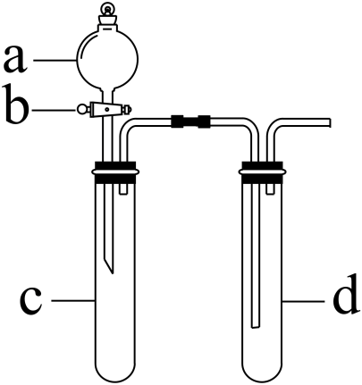〔图：a分液漏斗（b活塞）插入c试管，连接d试管的装置图〕

（1）实验前，关闭活塞b，试管d中加水至浸没长导管口，塞紧试管c和d的胶塞，加热c。其目的是                            。

（2）在d中加适量NaOH溶液，c中放一小块铜片，由分液漏斗a向c中加入2 mL浓硝酸。c中反应的化学方程式是                  。再由a向c中加2 mL蒸馏水，c中的实验现象是                           。

| 方案 | 反应物 |
|---|---|
| 甲 | Cu、浓HNO₃ |
| 乙 | Cu、稀HNO₃ |
| 丙 | Cu、O₂、稀HNO₃ |

（3）右表是制取硝酸铜的三种方案，能体现绿色化学理念的最佳方案是               。理由是             。

（4）该小组还用上述装置进行实验证明氧化性KMnO₄＞Cl₂＞Br₂。操作步骤为           ，实验现象为            ；但此实验的不足之处是                。

【答案】     检查装置气密性     Cu+4HNO₃(浓)=Cu(NO₃)₂+2NO₂↑+2H₂O     反应变缓，气体颜色变淡     丙     耗酸量最少，无污染     向d中加入KBr溶液，c中加入固体KMnO₄，由a向c中加入浓盐酸     c中有黄绿色气体产生，d中溶液变为黄棕色     没有处理尾气

【解析】（1）根据题目的叙述可以知道，这样操作的目的是检验装置的气密性，按题目所述若d试管内有气泡，且冷却后导管中有一段水柱，说明气密性良好。

（2）c中放一小块铜片，由分液漏斗a向c中加入2 mL浓硝酸时发生反应为Cu+4HNO₃ (浓)=Cu(NO₃)₂+2NO₂↑+2H₂O；若再由a向c中加2 mL蒸馏水，浓硝酸的浓度变小，所以反应变得缓慢、产生的气体颜色变浅。

（3）甲方案制取硝酸铜的反应方程式为Cu+4HNO₃ (浓)=Cu(NO₃)₂+2NO₂↑+2H₂O，乙方案制取硝酸铜的反应方程式为3Cu+8HNO₃ (稀)=3Cu(NO₃)₂+2NO↑+4H₂O，丙制取硝酸铜的反应方程式为2Cu＋O₂＋2HNO₃=2Cu(NO₃)₂。比较这三种方案的化学方程式可以发现均制取1molCu(NO₃)₂时消耗硝酸的量分别为4mol 、(8)/(3)mol 、1mol ，丙方案消耗的硝酸的量最少且不产生污染。

（4）若用上述装置进行实验证明氧化性KMnO₄＞Cl₂＞Br₂，根据氧化还原反应的规律可以得出应先用KMnO₄制Cl₂，再用Cl₂制Br₂。所以实验的操作步骤为向d中加入KBr溶液，c中

加入固体KMnO₄，由a向c中加入浓盐酸；其中实验的现象为c中有黄绿色气体产生，d中溶液变为黄棕色。但是由于Cl₂和Br₂均为有毒的气体，所以需要尾气处理。

知识点04 氮及其化合物综合

1．（2025·湖北·高考真题）如图所示的物质转化关系中，固体A与固体B研细后混合，常温下搅拌产生气体C和固体D，温度迅速下降。气体C能使湿润的红色石蕊试纸变蓝。G是一种强酸。H是白色固体，常用作钡餐。下列叙述错误的是

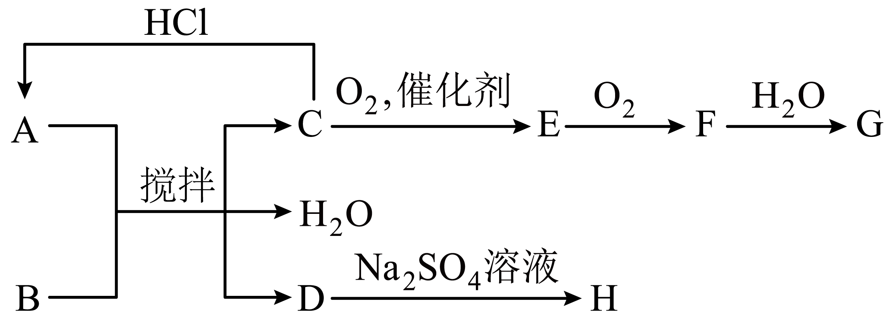〔图：A与B反应（搅拌）生成C、D和H₂O，C经O₂催化剂、O₂、H₂O转化为E、F、G，D与Na₂SO₄溶液生成H的转化关系图〕

> A．在C的水溶液中加入少量固体A，溶液pH升高
>
> B．D为可溶于水的有毒物质
>
> C．F溶于雨水可形成酸雨
>
> D．常温下可用铁制容器来盛装G的浓溶液

【答案】A

【解析】固体A与固体B研细后混合，常温下搅拌产生气体C和固体D，温度迅速下降。气体C能使湿润的红色石蕊试纸变蓝，则C为NH₃，G是强酸，则E是NO，F是NO₂，G是HNO₃；H是白色固体，常用作钡餐，H是BaSO₄，D是BaCl₂，A和B反应是NH₄Cl和Ba(OH)₂·8H₂O反应，C(NH₃)和HCl可转化为NH₄Cl，则A是NH₄Cl，B是Ba(OH)₂·8H₂O。A．在C(NH₃)的水溶液(氨水)中加入少量固体A(NH₄Cl)，铵根浓度增大，抑制了NH₃·H₂O的电离，OH⁻浓度减小，溶液pH减小，A错误；B．D(BaCl₂)易溶于水，溶于水电离出Ba²⁺，钡是重金属，有毒，B正确；C．F(NO₂)与水反应生成强酸硝酸，故NO₂溶于雨水可形成硝酸型酸雨，C正确；D．G是HNO₃，常温下浓HNO₃将Fe钝化，故常温下可用铁制容器来盛装浓硝酸，D正确；答案选A。

2．（2024·广西·高考真题）实验小组用如下流程探究含氮化合物的转化。NA为阿伏加德罗常数的值，下列说法正确的是

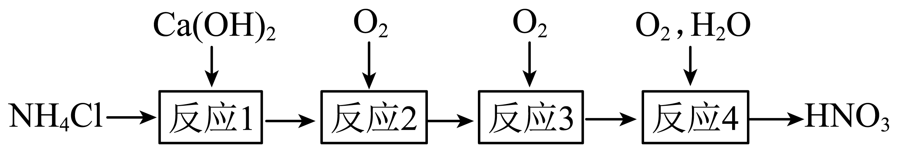〔图：NH₄Cl经反应1(Ca(OH)₂)、反应2(O₂)、反应3(O₂)、反应4(O₂,H₂O)制取HNO₃的流程图〕

> A．“反应1”中，每消耗0.1molNH₄Cl，在25℃、101kPa下得到2.24LNH₃
>
> B．“反应2”中，每生成0.1molNO，转移电子数为0.5NA
>
> C．在密闭容器中进行“反应3”，0.1molNO充分反应后体系中有0.1NA个NO₂
>
> D．“反应4”中，为使0.1molNO₂完全转化成HNO₃，至少需要0.02NA个O₂

【答案】B

【解析】反应1为实验室制备氨气的反应，方程式为：2NH₄Cl+Ca(OH)₂=(Δ)=2NH₃↑+CaCl₂+2H₂O，反应2是氨气的催化氧化，方程式为：4NH₃+5O₂=(Δ/催化剂)=4NO+6H₂O，反应3为一氧化氮和氧气反应生成二氧化氮，方程式为：2NO+O₂=2NO₂ ，反应4为二氧化氮，氧气和水反应生成硝酸，4NO₂+2H₂O+O₂=4HNO₃‌，以此解题。A．根据分析可知，每消耗0.1molNH₄Cl，生成0.1mol氨气，但是由于不是标准状况，则气体不是2.24L，A错误；B．根据分析可知，反应2方程式为：4NH₃+5O₂=(Δ/催化剂)=4NO+6H₂O，该反应转移20e⁻，则每生成0.1molNO，转移电子数为0.5NA，B正确；C．根据反应3，0.1molNO充分反应后生成0.1NA个NO₂，但是体系中存在2NO₂⇌N₂O₄，则最终二氧化氮数目小于0.1NA，C错误；D．根据反应4可知，为使0.1molNO₂完全转化成HNO₃，至少需要0.025NA个O₂，D错误；故选B。

3．（2024·浙江·高考真题）下列说法不正确的是

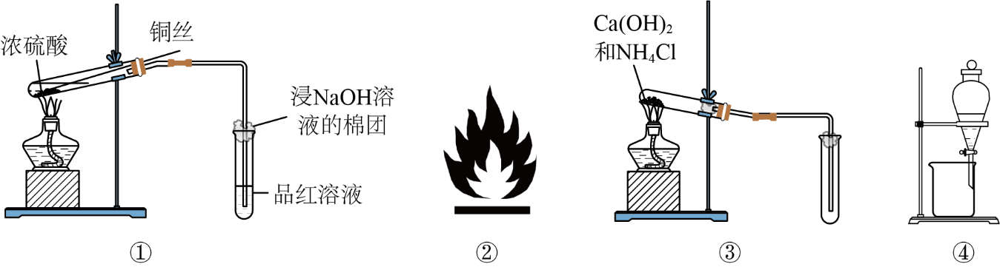〔图：①浓硫酸与铜丝加热并用浸NaOH溶液棉团、品红溶液检验；②火焰图标；③Ca(OH)₂和NH₄Cl加热装置；④分液漏斗与烧杯装置〕

> A．装置①可用于铜与浓硫酸反应并检验气态产物  B．图②标识表示易燃类物质
>
> C．装置③可用于制取并收集氨气 D．装置④可用于从碘水中萃取碘

【答案】C

【解析】A．铜与浓硫酸反应方程式为：Cu＋2H₂SO₄(浓) =(Δ)=CuSO₄＋2H₂O＋SO₂↑，可用装置①制取，气态产物为SO₂，可利用SO₂的漂白性进行检验，故A正确；B．图②标识表示易燃类物质，故B正确；C．NH₃的密度比空气小，应用向下排空气法进行收集，故C错误；D．萃取是利用物质在不同溶剂中溶解性的差异进行分离混合物，装置④可用于从碘水中萃取碘，故D正确；故选C。

4．（2023·江苏·高考真题）氮及其化合物的转化具有重要应用。下列说法不正确的是

> A．实验室探究稀硝酸与铜反应的气态产物：HNO₃(稀)=(Cu)=NO=(O₂)=NO₂
>
> B．工业制硝酸过程中的物质转化：N₂=(O₂/放电或高温)=NO=(H₂O)=HNO₃
>
> C．汽车尾气催化转化器中发生的主要反应：2NO+2CO=(催化剂)=N₂+2CO₂
>
> D．实验室制备少量NH₃的原理：2NH₄Cl+Ca(OH)₂=(Δ)=CaCl₂+2NH₃↑+2H₂O

【答案】B

【解析】A．Cu与稀硝酸的反应产物之一为NO，NO与氧气发生反应2NO+O₂=2NO₂生成NO₂，A正确；B．氮气与氧气在高温条件下生成NO，但NO无法与水发生化学反应，B错误；C．汽车尾气催化转化器主要将污染气体NO、CO转化为无污染的气体，故该反应方程式为2NO+2CO=(催化剂)=N₂+2CO₂，C正确；D．实验室利用熟石灰和氯化铵制备少量NH₃，化学方程式为2NH₄Cl+Ca(OH)₂=(Δ)=CaCl₂+2NH₃↑+2H₂O，D正确。 故选B。

5．（2023·湖北·高考真题）利用如图所示的装置(夹持及加热装置略)制备高纯白磷的流程如下：

〔图：红磷(s)加热变为无色液体与P₄(g)、再凝华得白磷(s)的转化示意图〕

下列操作错误的是

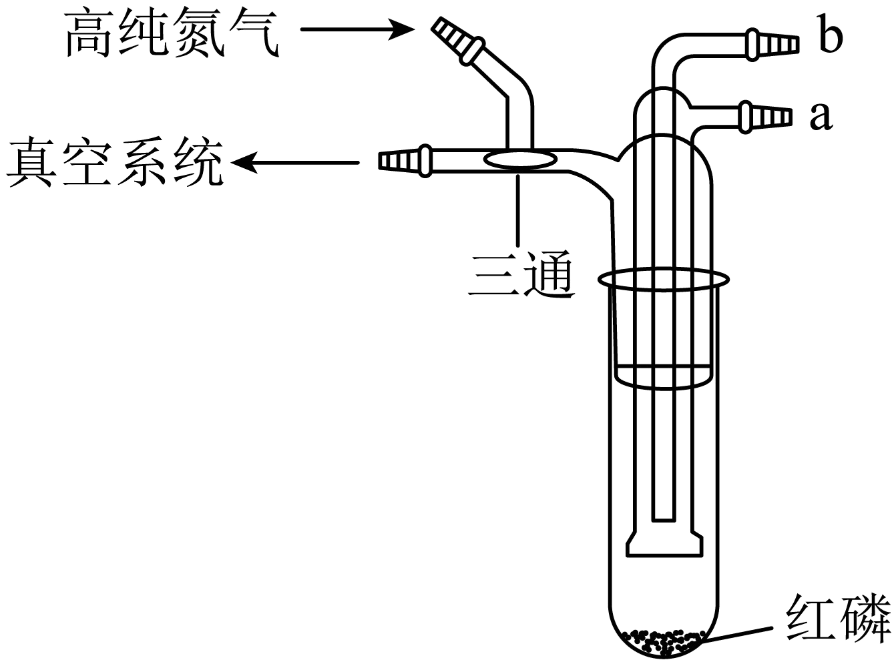〔图：带三通（接高纯氮气、真空系统）的红磷反应试管装置图（a、b为接口）〕

> A．红磷使用前洗涤以除去表面杂质
>
> B．将红磷转入装置，抽真空后加热外管以去除水和氧气
>
> C．从a口通入冷凝水，升温使红磷转化
>
> D．冷凝管外壁出现白磷，冷却后在氮气氛围下收集

【答案】C

【解析】A．红磷表面有被氧化生成的五氧化二磷，五氧化二磷可以溶于水，因此红磷在使用前应洗涤，A正确；B．真空环境可以降低物质的熔沸点，有利于将红磷转化为白磷，但是由于抽真空时不能将水气和氧气完全除去，还需要对装置外管进行加热，这时可以保证反应环境无水无氧，B正确；C．若从a口通入冷凝水，则冷凝水无法充满整个冷凝管，冷凝效果不好，需要用b口通入，此时可以将冷凝水充满冷凝管，C错误；D．白磷易被空气中的氧气氧化，因此在收集白磷时应将反应装置冷却，再在氮气氛的条件下收集白磷，D正确；故答案选C。

6．（2022·江苏·高考真题）氮及其化合物的转化具有重要应用。下列说法不正确的是

> A．自然固氮、人工固氮都是将N₂转化为NH₃
>
> B．侯氏制碱法以H₂O、NH₃、CO₂、NaCl为原料制备NaHCO₃和NH₄Cl
>
> C．工业上通过NH₃催化氧化等反应过程生产HNO₃
>
> D．多种形态的氮及其化合物间的转化形成了自然界的“氮循环”

【答案】A

【解析】A．自然固氮是将N₂转化为含氮化合物，不一定是转化为NH₃，比如大气固氮是将N₂会转化为NO，A错误；B．侯氏制碱法以H₂O、NH₃、CO₂、NaCl为原料制备NaHCO₃和NH₄Cl，反应的化学方程式为H₂O+NH₃+CO₂+NaCl=NaHCO₃↓+NH₄Cl，B正确；C．工业上通过NH₃催化氧化等反应过程生产HNO₃，相关的化学反应方程式为4NH₃+5O₂=(催化剂/Δ)=4NO+6H₂O、2NO+O₂=2NO₂、3NO₂+H₂O=2HNO₃+NO、4NO₂+O₂+2H₂O=4HNO₃，C正确；D．氮元素在自然界中既有游离态又有化合态，多种形态的氮及其化合物间的转化形成了自然界的“氮循环”，D正确；故选A。

7．（2013·安徽·高考真题）实验室中某些气体的制取、收集及尾气处理装置如图所示（省略夹持和净化装置）。仅用此装置和表中提供的物质完成相关实验，最合理的选项是

| 选项 | a中的物质 | b中的物质 | c中收集的气体 | d中的物质 | 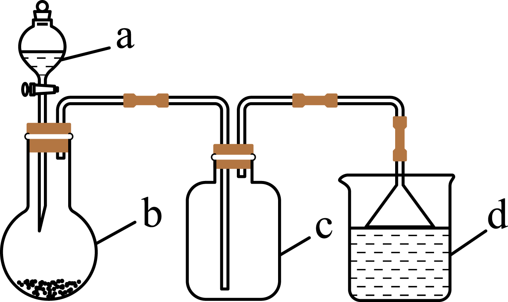〔图：a分液漏斗、b圆底烧瓶、c集气瓶、d烧杯（倒置漏斗防倒吸）组成的气体制取收集装置图〕 |
|---|---|---|---|---|---|
| A | 浓氨水 | CaO | NH₃ | H₂O |  |
| B | 浓硫酸(70%) | Na₂SO₃ | SO₂ | NaOH溶液 |  |
| C | 稀硝酸 | Cu | NO₂ | H₂O |  |
| D | 浓盐酸 | MnO₂ | Cl₂ | NaOH溶液 |  |

【答案】B

【解析】该装置分别为固液不加热制气体，向上排空气法收集气体，以及采用防倒吸的方法进行尾气处理。A．氨气密度比空气小，不能使用向上排空气法，错误；B．正确；C．铜与稀硝酸反应生成NO，NO与氧气迅速反应生成NO₂，且NO不溶于水，NO₂用水吸收会发生3 NO₂+ H₂O = 2 HNO₃+ NO，用防倒吸装置不妥，错误；D．制取氯气需要加热，错误。

8．（2007·北京·高考真题）如图所示，集气瓶内充满某混合气体，置于光亮处，将滴管内的水挤入集气瓶后，烧杯中的水会进入集气瓶，集气瓶气体是

> ① CO、O₂  ② Cl₂、CH₄ ③ NO₂、O₂ ④ N₂、H₂

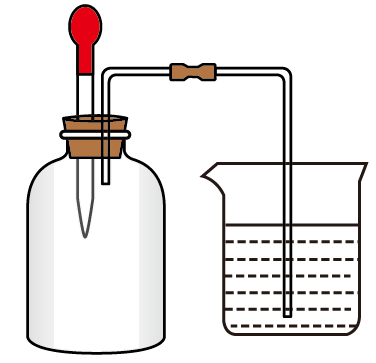〔图：胶头滴管插入集气瓶、导管连通烧杯的喷泉实验装置图〕

> A．①② B．②④ C．③④ D．②③

【答案】D

【解析】根据题意集气瓶中的气体在反应后产生易溶于水的气体或气体的体积减小了，① CO与O₂、④ N₂与H₂ 不反应，也不溶于水；② Cl₂与CH₄发生取代反应生成易溶于水的HCl；③ NO₂、O₂与H₂O反应生成硝酸使气体的体积减小了，所以选D。

9．（2014·北京·高考真题）NH₃经一系列反应可以得到HNO₃，如下图所示。

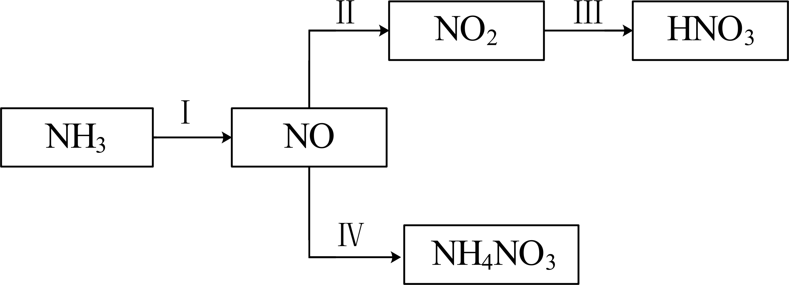〔图：NH₃经Ⅰ生成NO，NO经Ⅱ、Ⅳ分别生成NO₂、NH₄NO₃，NO₂经Ⅲ生成HNO₃的转化关系图〕

（1）I中，NH₃和O₂在催化剂作用下反应，其化学方程式是           。

（2）Ⅱ中，2NO(g)+O₂⇌2NO₂(g)。在其他条件相同时，分别测得NO的平衡转化率在不同压强(P₁、P₂)下温度变化的曲线(如图)。

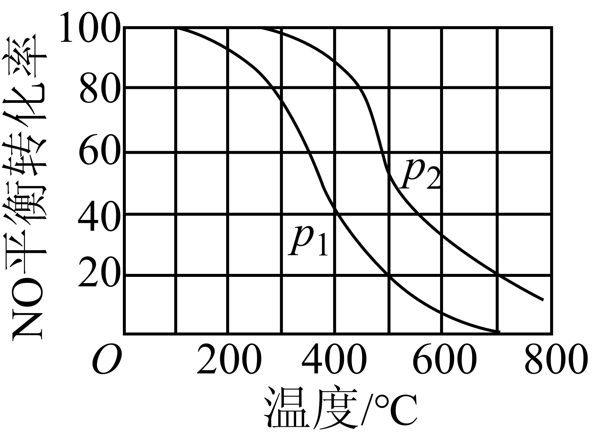〔图：NO平衡转化率随温度变化的曲线图（p₁、p₂两条曲线）〕

> ①比较P₁、P₂的大小关系：           。
>
> ②随温度升高，该反应平衡常数变化的趋势是           。

（3）Ⅲ中，降低温度，将NO₂(g)转化为N₂O₄(l)，再制备浓硝酸。

> ①已知：2NO₂(g)⇌ N₂O₄(g)△H₁

2NO₂(g)⇌ N₂O₄(l)△H₂

下列能量变化示意图中，正确的是(选填字母)           。

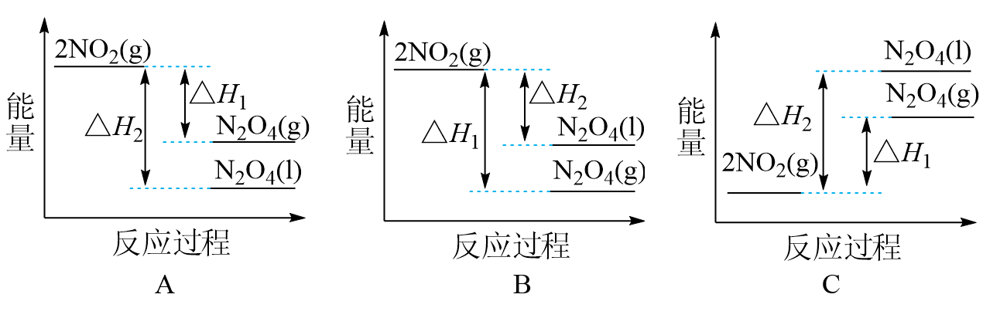〔图：A、B、C三个2NO₂(g)与N₂O₄(g)/N₂O₄(l)能量-反应过程图（标注ΔH₁、ΔH₂）〕

> ②N₂O₄与O₂、H₂O化合的化学方程式是           。

（4）Ⅵ中，电解NO制备 NH₄NO₃，其工作原理如图所示，为使电解产物全部转化为NH₄NO₃，需补充物质A，A是           ，说明理由：           。

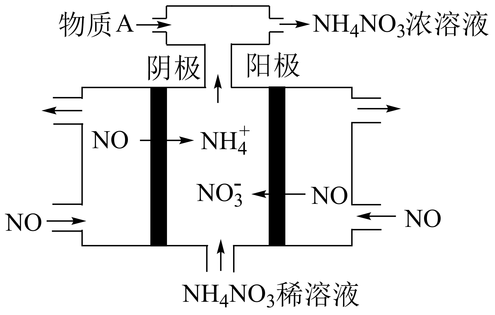〔图：电解NO制NH₄NO₃装置示意图（阴极NO→NH₄⁺，阳极NO→NO₃⁻，物质A循环，NH₄NO₃稀溶液进、浓溶液出）〕

【答案】     4NH₃+5O₂=(催化剂/加热)=4NO+6H₂O     P₁＜P₂     减小     A     2N₂O₄+O₂+2H₂O=4HNO₃     氨气     根据反应8NO+7H₂O=(电解)=3NH₄NO₃+2HNO₃，电解产生的HNO₃多

【解析】（1）氨气和氧气在催化剂作用下发氧化还原反应，生成NO和水，化学方程为4NH₃+5O₂=(催化剂/Δ)=4NO+6H₂O；

（2）①该反应的正反应为气体物质的量减小的反应，其他条件不变时，增大压强，平衡向气体物质的量减小的方向移动，即向正反应方向移动，即压强越高，NO的平衡转化率越大，根据图示知，相同温度下，压强P₁时NO的转化率＜P₂时NO的转化率，故P₁＜P₂；

②其他条件不变时，升高温度，平衡向着吸热反应方向移动，又根据图示知，相同压强下，随着温度的升高，NO的转化率降低，即升高温度，平衡向逆反应方向移动，故逆反应方向为吸热反应，则正反应方向是放热反应，则随着温度的升高，该反应的平衡常数减小；

（3）①

2NO₂(g)⇌ N₂O₄(g)△H₁ ①

2NO₂(g)⇌ N₂O₄(l)△H₂ ②

根据盖斯定律：①-②得

N₂O₄(g)⇌ N₂O₄(l) △H₃=△H₁-△H₂，一般来说，物质由气态变为液态，放出热量，即△H₃=△H₁-△H₂＜0，即△H₁＞△H₂，由降低温度，将NO₂转化为N₂O₄，可知该反应为放热反应，即0＞△H₁＞△H₂，即反应物2NO₂(g)的总能量大于生成物N₂O₄(g)和N₂O₄(l)的总能量，且前者放出的热量小，故答案为A；

②N₂O₄与氧气、水反应生成硝酸，化学方程式为：2N₂O₄+O₂+2H₂O=4HNO₃；

（4）电解NO制备硝酸铵，阳极反应为：NO-3e⁻+2H₂O=NO₃⁻+4H⁺，阴极反应为：NO+5e⁻+6H⁺=NH₄⁺+H₂O，从两极反应可看出若要使电子得失守恒，阳极产生的NO₃⁻的量大于阴极产生的NH₄⁺的量，总反应为8NO+7H₂O=(电解)=3NH₄NO₃+2HNO₃，故应补充适量的氨气。

10．（2007·上海·高考真题）氧化还原反应中实际上包含氧化和还原两个过程。下面是一个还原过程的反应式：NO₃⁻＋4H⁺＋3e→NO＋2H₂O ；KMnO₄、Na₂CO₃、Cu₂O、Fe₂(SO₄)₃四种物质中的一种物质(甲)能使上述还原过程发生。

（1）写出并配平该氧化还原反应的方程式：

（2）反应中硝酸体现了         、         性质。

（3）反应中若产生0.2mol气体，则转移电子的物质的量是        mol。

（4）若1mol甲与某浓度硝酸反应时，被还原硝酸的物质的量增加，原因是：                                   。

【答案】     14HNO₃＋3Cu₂O→6Cu(NO₃)₂＋2NO↑＋7H₂O     酸性     氧化性     0.6mol     使用了较浓的硝酸，产物中有部分二氧化氮生成

【解析】（1） 要使硝酸根离子发生还原反应，则需要加入还原剂，KMnO₄、Na₂CO₃、Cu₂O、Fe₂(SO₄)₃四种物质中KMnO₄、Fe₂(SO₄)₃具有强氧化性，Na₂CO₃没有氧化性和还原性，Cu₂O有还原性，所以能使硝酸根离子发生还原反应的是Cu₂O，二者反应生成硝酸铜、NO和水，反应方程式为14HNO₃+3Cu₂O=6Cu(NO₃)₂+2NO↑+7H₂O；

（2）硝酸在反应中既作了氧化剂，又生成了硝酸盐，所以硝酸表现出了氧化性和酸性。

（3） 反应中若产生0.2mol气体，则转移电子的数=0.2mol×(5-2)mol=0.6mol；

（4） 被还原硝酸的物质的量增加，说明每摩尔硝酸根离子得电子数减少，则生成的气体是二氧化氮。
